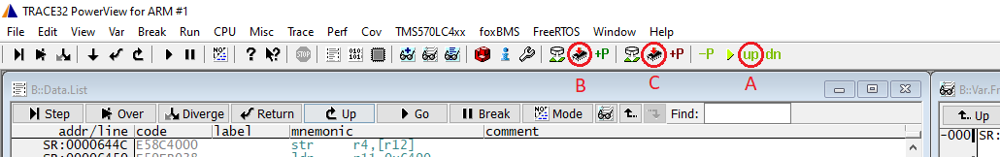

.. include:: ./../macros.txt
.. include:: ./../units.txt

.. _FIRST_STEPS_ON_HARDWARE:

First Steps on Hardware
=======================

This section gives a brief walk-through on setting up a debugger connection to
a |bms-master|.
Aim of this section is to check that all crucial parts of the toolchain work
and to recap the process of setting up the toolchain.

.. note::

   In order to be able to develop software for the BMS and deploy it to the
   embedded target, it is absolutely necessary to have these three
   components in place:

   - the embedded device itself,
   - a power supply,
   - a debugger.

Setup
-----

It is assumed, that all required software has been installed.
Details on the software installation can be found in
:ref:`SOFTWARE_INSTALLATION`.
Most notable parts of the toolchain are:

- the Python `venv` environment,
- the compiler toolchain,
- and a debugger.

Compilation
-----------

Details on this step are described in :ref:`BUILDING_THE_APPLICATION`.
The following steps should pass and result in the application being built.

.. note::

   |ti-halcogen| is not available on Linux, and therefore the code generator
   tool can not run on Linux.
   Therefore, in order to build on Linux, the build process needs to be run on
   Windows first, and then the entire directory
   ``build/app_embedded/src/app/hal`` needs to be copied to the Linux machine.
   These files should be converted to LF.
   After that Linux builds are possible.
   This procedure needs to be repeated everytime the HAL configuration files
   (``conf/hcg/app.hcg``, ``conf/hcg/app.dil``) are changed.

.. tabs::

  .. group-tab:: Win32/PowerShell

      .. code-block:: powershell

        .\fox.ps1 waf configure build_app_embedded

  .. group-tab:: Win32/Git bash

      .. code-block:: shell

        ./fox.ps1 waf configure build_app_embedded

  .. group-tab:: Linux

      .. code-block:: shell

        ./fox.ps1 waf configure build_app_embedded

If any error messages occurs, they have to be investigated before continuing.

.. _hardware_setup:

Hardware Setup
--------------

For this first setup, it is enough to connect a power supply and a debugger to
the |bms-master|.
Optionally, a CAN-interface can be connected to the CAN1 connector.
To debug or flash the binary file into the hardware, a debugger must also
be connected to the |bms-master|.
The connection is shown in :numref:`bms-master-connectors` and the
accompanying :numref:`bms-master-connectors-description`.
More details on the position and type of connectors can be found in
:ref:`CONNECTORS`.

.. drawio-figure:: ./img/bms-master-connectors.drawio
   :format: svg
   :alt: |bms-master| connectors
   :name: bms-master-connectors
   :width: 1040px

   |bms-master| connectors

.. csv-table:: |bms-master| connectors description
   :file: ./bms-master-connectors-description.csv
   :name: bms-master-connectors-description
   :header-rows: 1
   :delim: ;
   :widths: 20 40 40

.. _flash_the_bootloader:

Flash the Bootloader
--------------------

In order to update the application on the fly, the bootloader needs to be
compiled and flashed into the |bms-master| in advance, if it is not
pre-installed on the |bms-master|.
The following steps are needed to flash the bootloader:

#. Build the bootloader

   .. tabs::

      .. group-tab:: Win32/PowerShell

         .. code-block:: powershell

            .\fox.ps1 waf configure build_bootloader_embedded

      .. group-tab:: Win32/Git bash

         .. code-block:: shell

            ./fox.ps1 waf configure build_bootloader_embedded

      .. group-tab:: Linux

         .. code-block:: shell

            ./fox.ps1 waf configure build_bootloader_embedded

#. Flash the binary file of the bootloader into the |bms-master| using the
   debugger (e.g., `Lauterbach Trace32 debugger <http://www.lauterbach.com>`_):

   #. Connect the |bms-master| to a power supply and power it.
   #. Launch the Lauterbach Trace32 debugger using the shortcut at
      ``build/run_t32marm``.
      If another debugger is used, ignore this and the next steps and follow
      the instructions provided for that debugger to flash the bootloader
      binary file into the |bms-master|.
   #. Use the **"Up" button (A)** to set the |bms-master| to its "Up" state and
      then the **flash button (C)** to flash the bootloader binary
      (see :ref:`trace32_power_view`).

      .. figure:: img/trace32_power_view.png
         :width: 75 %
         :name: trace32_power_view
         :align: center
         :alt: trace32_power_view

         TRACE32 Power View

   #. The bootloader has been successfully flashed.

The bootloader now enables to flash an application binary on the |bms-master|
without using a debugger.

Flash/Update the |foxbms| Application Using the Bootloader
----------------------------------------------------------

Steps to flash/update the the |foxbms| application using the bootloader of the
|bms-master|:

#. Connect the host PC with the |bms-master| via CAN1 using an USB to CAN
   adapter.
#. Check the connection between the host PC and the bootloader by running:

   .. tabs::

      .. group-tab:: Win32/PowerShell

         .. code-block:: powershell

            .\fox.ps1 bootloader check

      .. group-tab:: Win32/Git bash

         .. code-block:: shell

            ./fox.sh bootloader check

      .. group-tab:: Linux

         .. code-block:: shell

            ./fox.sh bootloader check

   If the bootloader is connected and waiting for further commands, the message
   **Bootloader is running** will be displayed:

   .. code-block:: text

      Checking if the bootloader is online...
      Bootloader is running.

#. Flash/update the |foxbms| binary into the |bms-master|:

   **[Option 1]: If no foxBMS binary has ever been flashed into the target:**

      Entering the following command in the terminal:

      .. tabs::

         .. group-tab:: Win32/PowerShell

            .. code-block:: powershell

               .\fox.ps1 bootloader load-app

         .. group-tab:: Win32/Git bash

            .. code-block:: shell

               ./fox.sh bootloader load-app

         .. group-tab:: Linux

            .. code-block:: shell

               ./fox.sh bootloader load-app

      The following message indicates that the foxBMS application has been
      successfully uploaded to the |bms-master| and should be started:

      .. code-block:: text

         Uploading foxBMS 2 [1/3]: [▮▮▮▮▮▮▮▮▮▮▮▮▮▮▮▮▮▮▮▮▮▮▮▮▮] 100%
         Successfully uploaded the application binary to the target, start the foxBMS application!

   **[Option 2]: If any foxBMS binary has already been flashed into the target:**

      Power off the |bms-master| and enter the following command in the
      terminal:

      .. tabs::

         .. group-tab:: Win32/PowerShell

            .. code-block:: powershell

               .\fox.ps1 bootloader load-app

         .. group-tab:: Win32/Git bash

            .. code-block:: shell

               ./fox.sh bootloader load-app

         .. group-tab:: Linux

            .. code-block:: shell

               ./fox.sh bootloader load-app

      Power on the |bms-master| after the following instruction is displayed in
      the terminal:

      .. code-block:: text

         Waiting for the bootloader to be powered on ...

More details about the bootloader can be found in :ref:`BOOTLOADER`.

.. _flash_the_application_using_the_debugger:

Flash/Debug the Application Using the Debugger
----------------------------------------------

Start the TRACE32 software using the shortcut |lauterbach-debugger-shortcut|
that is generated during project configuration (only generated if Lauterbach is
available), and click the **"Up" button (A)** to set the |bms-master| to its
``Up`` state.
After that, click the **flash button (B)** to flash the |foxbms| application.

   Lauterbach TRACE32 UI to flash the embedded software

After the binary is successfully flashed, the user can start the application
and debug it using the features of the debugger software.
More details on setting up the debugger toolchain can be found in
:ref:`DEBUGGING_THE_APPLICATION`.
