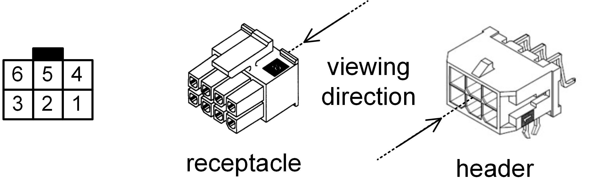

.. include:: ./../macros.txt
.. include:: ./../units.txt

.. _CONNECTORS:

Connectors
==========

This section summarizes the types of connectors used in |foxbms|.

|tbc|

..
    Comment: This section should contain: Molex connectors, the extension
    connectors, additional pin header, JTAG connectors (both cTI and Mictor)

.. _CONVENTION_FOR_CONNECTOR_PIN_NUMBERING:

Convention for Connector Pin Numbering
--------------------------------------

:numref:`molex-connector-numbering` presents the convention for the numbering
of pins in Molex connectors.
This type of connector is the main type of connector that is used for |foxbms|.
The numbering style is used throughout this documentation.

   Supply connector pin out, receptacle - rear view, header - front view
   (image source: MOLEX)

There are two types of connectors:

 * Header
 * Receptacle, plugged into the header

The numbering shown on the left in :numref:`molex-connector-numbering`
is always valid when viewing in the direction indicated by the arrow with the
indication ``viewing direction``.
This must be taken into account when crimping the receptacles.
