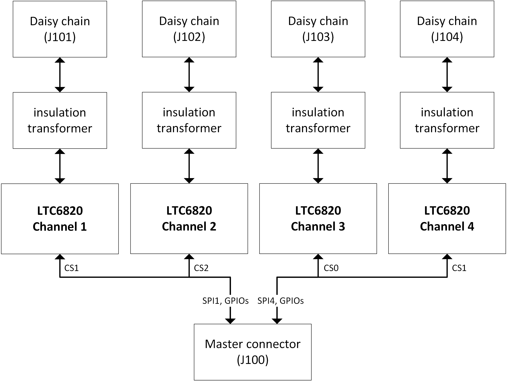

.. include:: ./../../../macros.txt
.. include:: ./../../../units.txt

.. _INTERFACE_LTC_6820___V1_0_3__:

Interface LTC-6820 ``v1.0.3``
=============================

.. |local_interface_version|  replace:: ``1.0.3``

--------
Overview
--------

.. important::

   The following description only applies for the |ltc6820|\ -based
   |bms-interface| hardware version |local_interface_version|.

.. hint::

   All connector pinouts described below follow the
   :ref:`CONVENTION_FOR_MOLEX_3_0_CONNECTOR_PIN_NUMBERING` and
   :ref:`CONVENTION_FOR_SAMTEC_EDGE_RATE_CONNECTOR_PIN_NUMBERING`.

The |bms-interface| is used to enable communication between the |bms-master|
and the |bms-slaves|.
A 3D rendering of the |bms-interface| is shown in
:numref:`Fig. %s <interface-ltc6820_v1.0.3_rendering>`.
The |bms-interface| is intended to be used together with a |bms-master|.

.. _interface-ltc6820_v1.0.3_rendering:
.. figure:: ./ltc-ltc6820-v1.0.3/ltc-ltc6820-v1.0.3_rendering.png
   :width: 80 %

   3D rendering of the |bms-interface|

--------------
Specifications
--------------

^^^^^^^^^^^^^^^^^^^^^
Mechanical Dimensions
^^^^^^^^^^^^^^^^^^^^^

The size of the PCB is 70 |_| |mm| |_| x |_| 120 |_| |mm|. A 3D-model and a
drawing of the PCB can be found in section :ref:`DESIGN_RESOURCES`.

^^^^^^^^^^^^^^^^^
isoSPI Insulation
^^^^^^^^^^^^^^^^^

The interface board is designed for a maximum continuous insulation voltage of
1250 |_| V |_| DC between all four isoSPI channels and between each isoSPI
channel and the |bms-master|.

The insulation is designed according to DIN |_| EN |_| 60664-1:2008-01 under
the following conditions:

- Type of insulation: functional
- Electrical field: homogeneous
- Pollution degree: 2
- PCB insulator class: 3b
- Transient voltage: 4300 |_| V |_| DC
- Continuous (working) voltage: 1250 |_| V |_| DC (selected due to design
  space constraints on PCB)

The PCB design complies with the following parameters:

- Clearance: 1.3 |_| |mm|
- Creepage distance: 12.5 |_| |mm|

^^^^^^^^^^^^^
Block Diagram
^^^^^^^^^^^^^

A block diagram of the |bms-interface| is shown in
:numref:`Fig. %s <interface-ltc6820_v1.0.3_block_diagram>`.

.. _interface-ltc6820_v1.0.3_block_diagram:

   Block diagram of the |bms-interface|

Each of the four isoSPI channels uses one |ltc6820| communication chip from
|adi| and an insulation transformer.
The |ltc6820| chips are directly connected to the MCU via |spi|.

^^^^^^^^^^^^^^^^^^^^^^^^^^
Schematic and Board Layout
^^^^^^^^^^^^^^^^^^^^^^^^^^

More information about the board schematic and layout files can be found in
section :ref:`DESIGN_RESOURCES`.
For better debugging, there are test-points on the PCB for all relevant IO
signals.

---------
Functions
---------

^^^^^^^^^^^^^^^^^^^^
isoSPI communication
^^^^^^^^^^^^^^^^^^^^

The |bms-interface| offers up to four isolated isoSPI communication channels
using the |ltc6820| transceiver chip from |adi|.
The |ltc6820| transceivers are controlled by the SPI signals from the
|bms-master|.
The isoSPI signals are available on the connectors J101, J102, J103 and J104.
The pinout of these connectors is described in
:numref:`Table %s <interface-ltc6820_v1.0.3_isoSPI_connectors>`.

.. csv-table:: isoSPI Daisy Chain Output Connectors
   :name: interface-ltc6820_v1.0.3_isoSPI_connectors
   :header-rows: 1
   :delim: ;
   :file: ./ltc-ltc6820-v1.0.3/ltc-ltc6820-v1.0.3_isospi_connectors.csv

For the connection to the |bms-master|, a 40-pole mezzanine connector (J100)
is used. The pinout and pin usage is described in
:numref:`Table %s <interface-ltc6820_v1.0.3_master_connector>`.

.. csv-table:: Signal connector to |bms-master|
   :name: interface-ltc6820_v1.0.3_master_connector
   :header-rows: 1
   :delim: ;
   :file: ./ltc-ltc6820-v1.0.3/ltc-ltc6820-v1.0.3_master_connector.csv
