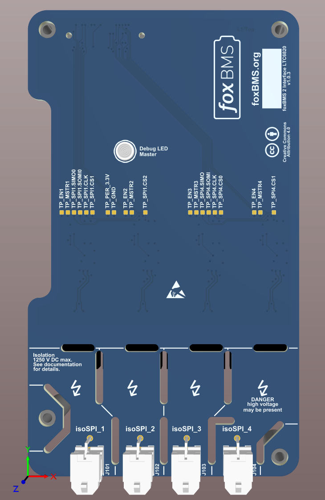

.. include:: ./../../../macros.txt
.. include:: ./../../../units.txt

.. _INTERFACE_LTC_6820_V1_0_3:

Interface LTC-6820 V1.0.3
=========================

.. |local_interface_version|  replace:: ``1.0.3``

--------
Overview
--------

.. important::

   The following description only applies for the |ltc6820|\ -based
   |bms-interface| hardware version |local_interface_version|.

.. hint::

   All connector pinouts described below follow the
   :ref:`CONVENTION_FOR_CONNECTOR_PIN_NUMBERING`.

The |bms-interface| is used to enable communication between the |bms-master|
and the |bms-slaves|.
A 3D rendering of the |bms-interface| is shown in
:numref:`Fig. %s <interface-ltc6820_v1.0.3_rendering>`.
The |bms-interface| is intended to be used together with a |bms-master|.

.. _interface-ltc6820_v1.0.3_rendering:

   3D rendering of the |bms-interface|

^^^^^^^^^^^^^
Block Diagram
^^^^^^^^^^^^^

|tbc|

^^^^^^^^^^^^^^^^^^^^^^^^^^
Schematic and Board Layout
^^^^^^^^^^^^^^^^^^^^^^^^^^

More information about the board schematic and layout files can be found in
section :ref:`DESIGN_RESOURCES`.

---------
Functions
---------

^^^^^^^^^^^^^^^^^^^^
isoSPI communication
^^^^^^^^^^^^^^^^^^^^

The |bms-interface| offers up to four isolated isoSPI communication channels
using the |ltc6820| transceiver chip from |adi|.
The |ltc6820| transceivers are controlled by the SPI signals from the
|bms-master|.
The isoSPI signals are available on the connectors J101, J102, J103 and J104.
The pinout is described in
:numref:`Table %s <interface-ltc6820_v1.0.3_isoSPI_connectors>`.

.. csv-table:: isoSPI Daisy Chain Output Connectors
   :name: interface-ltc6820_v1.0.3_isoSPI_connectors
   :header-rows: 1
   :delim: ;
   :file: ./ltc-ltc6820-v1.0.3/ltc-ltc6820-v1.0.3_isospi_connectors.csv

--------------
Specifications
--------------

^^^^^^^^^^^^^^^^^^^^^
Mechanical Dimensions
^^^^^^^^^^^^^^^^^^^^^

The size of the PCB is 70x120mm.

^^^^^^^^^^^^^^^^
isoSPI Isolation
^^^^^^^^^^^^^^^^

|tbc|
