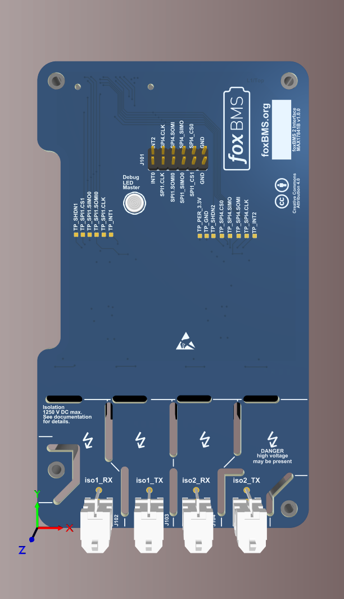
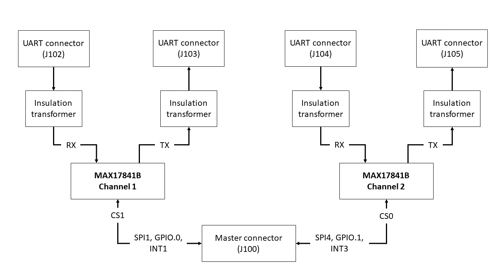

.. include:: ./../../../macros.txt
.. include:: ./../../../units.txt

.. _INTERFACE_MAX17841B___V1_0_0__:

Interface MAX17841B ``v1.0.0``
==============================

.. |local_interface_version|  replace:: ``1.0.0``

--------
Overview
--------

.. important::

   The following description only applies for the |max17841b|\ -based
   |bms-interface| hardware version |local_interface_version|.

.. hint::

   All connector pinouts described below follow the
   :ref:`CONVENTION_FOR_MOLEX_3_0_CONNECTOR_PIN_NUMBERING` and
   :ref:`CONVENTION_FOR_SAMTEC_EDGE_RATE_CONNECTOR_PIN_NUMBERING`.

The |bms-interface| is used to enable communication between the |bms-master|
and the |bms-slaves|.
A 3D rendering from the TOP side view of the |bms-interface| is shown in
:numref:`Fig. %s <interface-max17841b_v1.0.0_rendering>`.
The |bms-interface| is intended to be used together with a |bms-master|.

.. _interface-max17841b_v1.0.0_rendering:

   3D rendering of the |bms-interface|

--------------
Specifications
--------------

^^^^^^^^^^^^^^^^^^^^^
Mechanical Dimensions
^^^^^^^^^^^^^^^^^^^^^

The size of the PCB is 70 |_| |mm| |_| x |_| 120 |_| |mm|. A 3D-model and a
drawing of the PCB can be found in :ref:`DESIGN_RESOURCES`

^^^^^^^^^^^^^^^^^^^^^^^^^^^^^^^^^^
Battery Management UART Insulation
^^^^^^^^^^^^^^^^^^^^^^^^^^^^^^^^^^

The interface board is designed for a maximum continuous insulation voltage of
1250 |_| V |_| DC between all two Maxim Battery Management UART channels and
between each Maxim Battery Management UART channel and the |bms-master|.

The insulation is designed according to DIN |_| EN |_| 60664-1:2008-01 under
the following conditions:

- Type of insulation: functional
- Electrical field: homogeneous
- Pollution degree: 2
- PCB insulator class: 3b
- Transient voltage: 4300 |_| V |_| DC
- Continuous (working) voltage: 1250 |_| V |_| DC (selected due to design
  space constraints on PCB)

The PCB design complies with the following parameters:

- Clearance: 1.3 |_| |mm|
- Creepage distance: 12.5 |_| |mm|

^^^^^^^^^^^^^
Block Diagram
^^^^^^^^^^^^^

A block diagram of the |bms-interface| is shown in
:numref:`Fig. %s <interface-max17841b_v1.0.0_block_diagram>`.

.. _interface-max17841b_v1.0.0_block_diagram:

   Block diagram of the |bms-interface|

Each |max17841b| communication chip from |mxm| provides one UART channel.
Each channel is comprised of a RX and a TX signal, each using one insulation
transformer.
The |max17841b| chips are directly connected to the MCU via |spi|.

^^^^^^^^^^^^^^^^^^^^^^^^^^
Schematic and Board Layout
^^^^^^^^^^^^^^^^^^^^^^^^^^

More information about the board schematic and layout files can be found in
section :ref:`DESIGN_RESOURCES`.
For better debugging, there are test-points on the PCB for all relevant IO
signals.
In addition to test-points, a pin header (J101) allows an easier connection to
a logic analyzer.

---------
Functions
---------

^^^^^^^^^^^^^^^^^^^^^^^^^^^^^^^^^^^^^^^^^^^
Maxim Battery Management UART communication
^^^^^^^^^^^^^^^^^^^^^^^^^^^^^^^^^^^^^^^^^^^

The |bms-interface| offers up to two isolated Maxim Battery Management UART
communication channels using the |max17841b| transceiver chip from |mxm|.
The |max17841b| transceivers are controlled by the SPI signals from the
|bms-master|.
The UART RX signals are available on the connectors J102 and J104.
The pinout of the connectors is described in
:numref:`Table %s <interface-max17841b_v1.0.0_uartrx_connectors>`.

.. csv-table:: UART RX Input Connectors
   :name: interface-max17841b_v1.0.0_uartrx_connectors
   :header-rows: 1
   :delim: ;
   :file: ./maxim-max17841b-v1.0.0/maxim-max17841b-v1.0.0_uartrx_connectors.csv

The UART TX signals are available on the connectors J103 and J105.
The pinout of the connectors is described in
:numref:`Table %s <interface-max17841b_v1.0.0_uarttx_connectors>`.

.. csv-table:: UART TX Output Connectors
   :name: interface-max17841b_v1.0.0_uarttx_connectors
   :header-rows: 1
   :delim: ;
   :file: ./maxim-max17841b-v1.0.0/maxim-max17841b-v1.0.0_uarttx_connectors.csv

For the connection to the |bms-master|, a 40-pole mezzanine connector (J100)
is used. The pinout and pin usage is described in
:numref:`Table %s <interface-max17841b_v1.0.0_master_connector>`

.. csv-table:: Signal connector to |bms-master|
   :name: interface-max17841b_v1.0.0_master_connector
   :header-rows: 1
   :delim: ;
   :file: ./maxim-max17841b-v1.0.0/maxim-max17841b-v1.0.0_master_connector.csv

All important IO signals are connected to a pin header (J101) to provide an
easy connection to a logic analyzer. The pinout of this header is described in
:numref:`Table %s <interface-max17841b_v1.0.0_debug_connector>`

.. csv-table:: Debug connector
   :name: interface-max17841b_v1.0.0_debug_connector
   :header-rows: 1
   :delim: ;
   :file: ./maxim-max17841b-v1.0.0/maxim-max17841b-v1.0.0_debug_connector.csv
