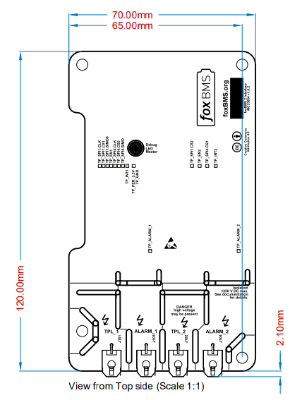

.. include:: ./../../../macros.txt
.. include:: ./../../../units.txt

.. _INTERFACE_MC33664___V1_0_2__:

Interface MC33664 ``v1.0.2``
============================

.. |local_interface_version|  replace:: ``1.0.2``

--------
Overview
--------

.. important::

   The following description only applies for the |mc33664|\ -based
   |bms-interface| hardware version |local_interface_version|.

.. hint::

   All connector pinouts described below follow the
   :ref:`CONVENTION_FOR_MOLEX_3_0_CONNECTOR_PIN_NUMBERING` and
   :ref:`CONVENTION_FOR_SAMTEC_EDGE_RATE_CONNECTOR_PIN_NUMBERING`.

The |bms-interface| is used to enable communication between the |bms-master|
and the |bms-slaves|.

--------------
Specifications
--------------

^^^^^^^^^^^^^^^^^^^^^
Mechanical Dimensions
^^^^^^^^^^^^^^^^^^^^^

The mechanical dimensions of this |BMS-Interface| are shown in
:numref:`Fig. %s <nxp-mc33664-v1.0.2_mechanical-dimensions>`.

   Mechanical dimensions of the |mc33664|\ -based |bms-interface| hardware
   (version |local_interface_version|).

^^^^^^^^^^^^^^^^^^^^^^^^^^
Schematic and Board Layout
^^^^^^^^^^^^^^^^^^^^^^^^^^

More information about the board schematic and layout files can be found in
section :ref:`DESIGN_RESOURCES`.
For better debugging, there are test-points on the PCB for all relevant IO
signals.

---------
Functions
---------

|tbc|
