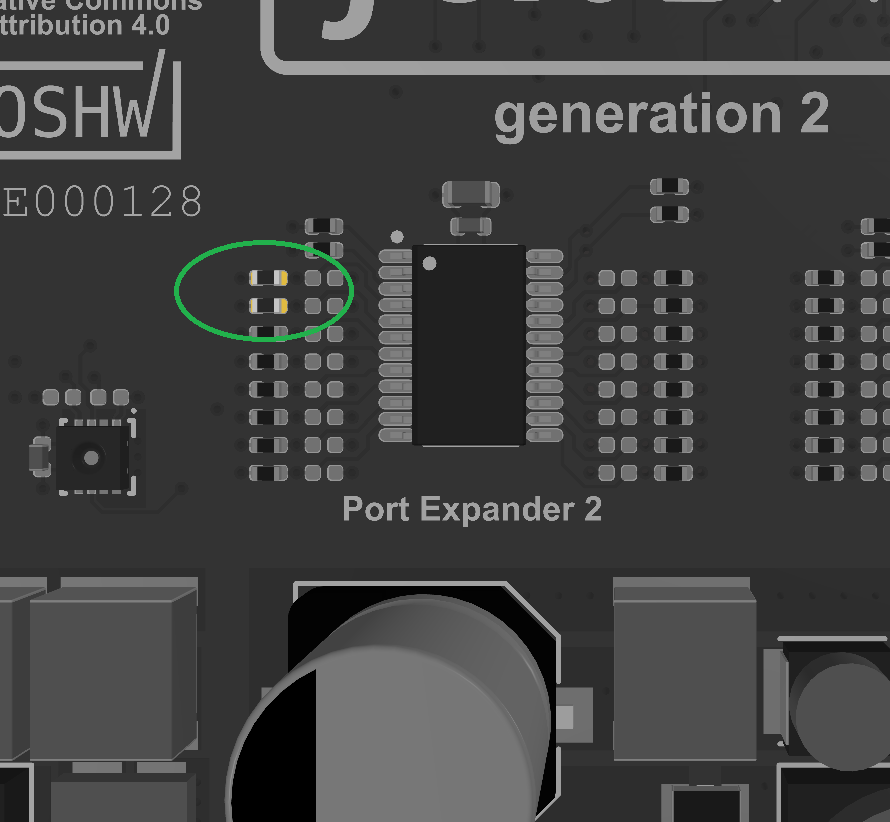

.. include:: ./../../../macros.txt
.. include:: ./../../../units.txt

.. _MASTER_TMS570___V1_1_1__:

Master TMS570 ``v1.1.1``
========================

.. note::

   The changelog for this release is found at
   :ref:`CHANGELOG_FOR_MASTER_TMS570_V1_1_1`.

.. important::

   BMS-Master release :ref:`MASTER_TMS570___V1_2_2__` is designed and prepared
   for a CAN based bootloader for remote firmware update.
   Follow the instructions to establish bootload compatibility on older
   hardware.

The following specifications must be met to ensure a safe and optimal work with
the |bms-master| hardware.

^^^^^^^^^^^^^^^^^^^^^^^^^^^^^^^^^^^^^^^^^^^^^^^^^^^^^^^^
Bootloader Compatibility on |bms-master| prior to v1.2.2
^^^^^^^^^^^^^^^^^^^^^^^^^^^^^^^^^^^^^^^^^^^^^^^^^^^^^^^^

In |bms-master| release :ref:`MASTER_TMS570___V1_2_2__`, the CAN1 Enable and
Standby signals have been wired directly to the MCU, instead of using I2C based
port expander.
Therefore, on |bms-master| prior to v1.2.2 the CAN1 transceiver would not be
enabled during bootloader operation, lacking the feature of firmware update
capability.

By desoldering populated 10kOhm pull-down resistors R6320_2 and R6321_2, the
CAN1 transceiver will be enabled by default and is available during
bootloader operation.

Details are shown in
:numref:`resistors-for-foxbms_v1.1.1._bootloader_compatibility`.

   Resistors R6320_2 and R6321_2 to be removed for compatibility with bootloader

^^^^^^^^^^^^^^^^^^
Electrical Ratings
^^^^^^^^^^^^^^^^^^

==================================================  =======     =======     =======     ====
Description                                         Minimum     Typical     Maximum     Unit
==================================================  =======     =======     =======     ====
Supply Voltage Clamp 30 (VSUP_30)                   9           12          55          V DC
Supply Voltage Clamp 30C (VSUP_30C)                 9           12          55          V DC
Contactor Continuous Current                        --          --          1.8         A
Contactor Feedback Supply Voltage                   --          VSUP_30     --          V
Interlock Circuit Sink Current                      --          10          --          mA
Idle Supply Current at 12V DC for VSUP_30           --          215         --          mA
Idle Supply Current at 24V DC for VSUP_30           --          160         --          mA
==================================================  =======     =======     =======     ====

^^^^^^^^^^^^^^^^^^^^^^^^^^^^^^^^^^^^^^^^^^^
Mechanical Dimensions (BMS-Master PCB only)
^^^^^^^^^^^^^^^^^^^^^^^^^^^^^^^^^^^^^^^^^^^

==================================================  =======     =======
Description                                         Value       Unit
==================================================  =======     =======
Width                                               120         mm
Length                                              200         mm
Height                                              13          mm
Weight                                              129         g
==================================================  =======     =======

.. toctree::
    :maxdepth: 1

    ./ti-tms570lc4357-v1.1.1/ti-tms570lc4357-v1.1.1_block_diagram.rst
    ./ti-tms570lc4357-v1.1.1/ti-tms570lc4357-v1.1.1_functional_description.rst
    ./ti-tms570lc4357-v1.1.1/ti-tms570lc4357-v1.1.1_pinout.rst
