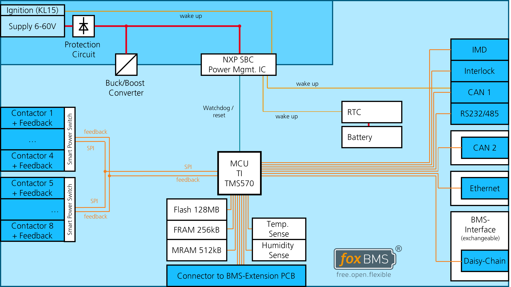

.. include:: ./../../../../macros.txt
.. include:: ./../../../../units.txt

.. _MASTER_TMS570___V1_2_2___BLOCK_DIAGRAM:

Master TMS570 ``v1.2.2`` Block diagram
======================================

A block diagram of the |bms-master| is shown in figure
:numref:`foxbms-2-master-hardware-block-diagram-v1.2.2`.

   Block diagram of the |bms-master| hardware
