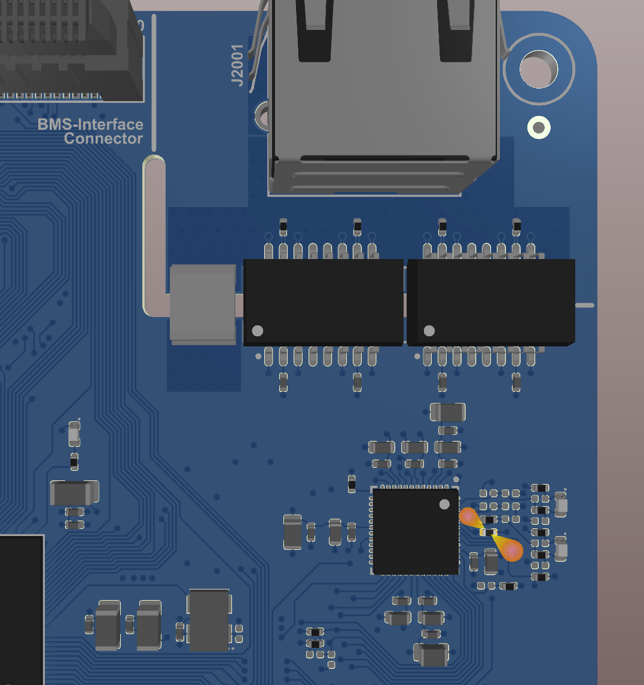

.. include:: ./../../../macros.txt
.. include:: ./../../../units.txt

.. |local_bms_master_version| replace:: ``v1.2.3``
.. |local_bms_master_identifier_short| replace:: |ti-tms570|\-based |bms-master|
.. |local_bms_master_identifier_full| replace:: |local_bms_master_identifier_short| |local_bms_master_version|

.. _TI_TMS570_BASED_BMS_MASTER_V1_2_3:

|local_bms_master_identifier_full|
==================================

.. note::

   The changelog for this release is found at
   :numref:`CHANGELOG_FOR_THE_TI_TMS570_BASED_BMS_MASTER_V1_2_3`.

There are no changes that need a new documentation compared to v1.2.2,
therefore see :ref:`TI_TMS570_BASED_BMS_MASTER_V1_2_2`.

.. _REMOVING_THE_PULL_UP_RESISTOR_FOR_THE_PHY:

^^^^^^^^^^^^^^^^^^^^^^^^^^^^^^^^^^^^^^^^^^
Removing the Pull-up Resistor for the PHY
^^^^^^^^^^^^^^^^^^^^^^^^^^^^^^^^^^^^^^^^^^

In |bms-master| v1.2.3 and below, the PHY is enabled by default,
which can cause issues when connecting the Ethernet cable.
To avoid this, the pull-up resistors enabling the PHY should be removed.
The image below shows the location of the pull-up resistors on the PCB.

