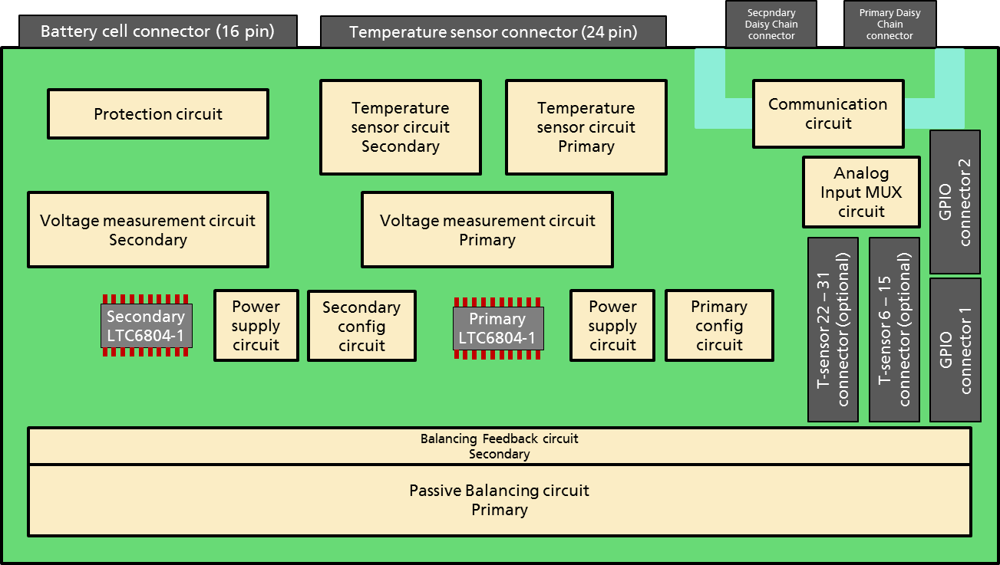
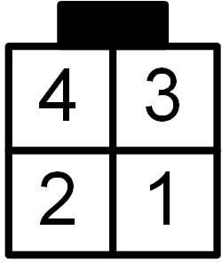
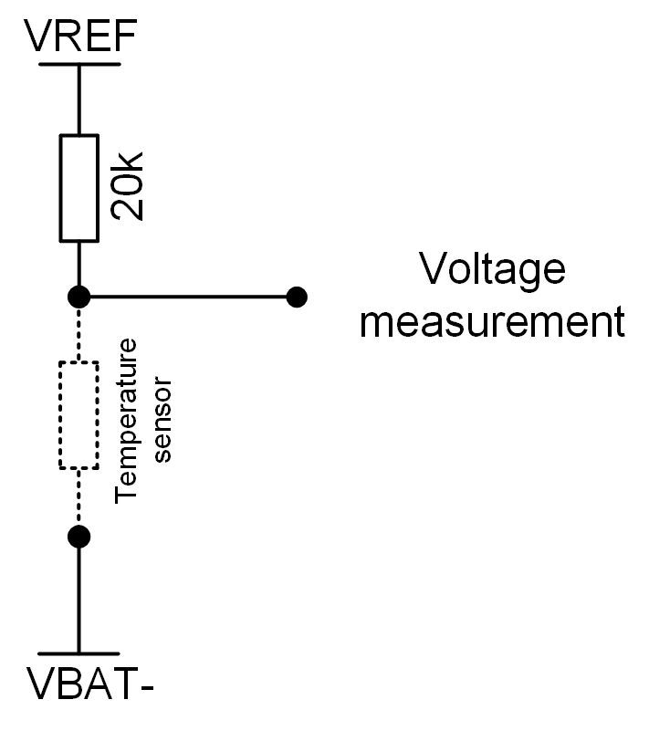

.. include:: ./../../../macros.txt
.. include:: ./../../../units.txt

.. _LTC6804_1_BASED_12_CELL_SLAVE____V1_X_X___:

LTC6804-1-based 12-Cell Slave (``v1.x.x``)
==========================================

.. |local_slave_version|  replace:: ``1.x.x``

--------
Overview
--------

.. important::

   The following description only applies for the |ltc6804-1|\ -based 12 cell
   |BMS-Slave| hardware versions |local_slave_version|.

.. hint::

   All connector pinouts described below follow the
   :ref:`CONVENTION_FOR_CONNECTOR_PIN_NUMBERING`.

^^^^^^^^^^^^^
Block Diagram
^^^^^^^^^^^^^

The block diagram of the |BMS-Slave| is shown in
:numref:`Fig. %s <block_diagram_6804-1_slave_12cell_v1.x.x>`

.. _block_diagram_6804-1_slave_12cell_v1.x.x:

   |BMS-Slave| 12-Cell Block Diagram

^^^^^^^^^^^^^^^^^^^^^^^^^^
Schematic and Board Layout
^^^^^^^^^^^^^^^^^^^^^^^^^^

More information about the board schematic and layout files can be found in
section :ref:`DESIGN_RESOURCES`.

^^^^^^^^^^^^^^^^^^^^^
Mechanical Dimensions
^^^^^^^^^^^^^^^^^^^^^

The size of the PCB is 160x100mm.

.. figure:: ./../../img/molex_connector-16pin.png
   :width: 30 %

.. csv-table:: |BMS-Master| Daisy Chain Connector
   :name: master_daisy_connector
   :header-rows: 1
   :delim: ;
   :file: ./12-ltc-ltc6804-1-v1.x.x/12-ltc-ltc6804-1-v1.x.x_master_daisy_connector.csv

.. note::
   This connector pin out is only valid for use of a foxBMS Master Interface
   board for the |ltc6804-1| monitoring IC.

On the |BMS-Slave|, the connectors indicated as
``Primary Daisy Chain connector`` and ``Secondary Daisy Chain connector`` in
:numref:`Fig. %s <block_diagram_6804-1_slave_12cell_v1.x.x>` must be used.
Their layout is described in :numref:`Table %s <primary_daisy_connector>`.

.. csv-table:: Primary Daisy Chain Connector
   :name: primary_daisy_connector
   :header-rows: 1
   :delim: ;
   :file: ./12-ltc-ltc6804-1-v1.x.x/12-ltc-ltc6804-1-v1.x.x_primary_daisy_connector.csv

The |OUT+| and |OUT-| pins of the |BMS-Master| go to the |IN+| and |IN-| pins
of the |BMS-Slave|.
A cable with a receptable on both ends must be crimped correctly to make the
connection.

In case a second |BMS-Slave| must be connected to the daisy chain, the |OUT+|
and |OUT-| pins of the first |BMS-Slave| must be connected to the |IN+| and
|IN-| pins of the second |BMS-Slave|.

--------------------------------------
Cell Voltage Connector on the |slaves|
--------------------------------------

The connector indicated as ``Battery cell connector (16 pin)`` in
:numref:`Fig. %s <block_diagram_6804-1_slave_12cell_v1.x.x>` has two purposes:

 * Supply of the |BMS-Slave|
 * Input of the cell voltages to the |ltc6804-1| monitoring chip

The layout of the connector is described in
:numref:`Table %s <cell_voltage_connector>`.
Up to 12 battery cells can be connected in series, between |VBAT+| and |VBAT-|.
The |BMS-Slave| is supplied by |VBAT+| and |VBAT-|.
The total voltage of all cells in series must be between 11V and 55V
(see [ltc_data_sheet_6804]_ and [ltc_data_sheet_6811]_).
0- correspond to the negative pole of cell 0, 0+ to the positive pole of cell 0, 1- correspond to the negative pole of cell 1, 1+ to the positive pole of cell 1 and so one till 11+, the positive pole of cell 11. As the cells are connected in series, the positive pole of one cell is connected to the negative pole of the next cell: 0+ to 1-, 1+ to 2+ and so on.
The poles should be connected to the cell voltage connector as shown in
:numref:`Table %s <cell_voltage_connector>`.

If less than 12 battery cells are used, information on how to connect them can
be found |ltc6804-1| data sheets ([ltc_data_sheet_6804]_ and
[ltc_data_sheet_6811]_).

.. _cell_voltage_connector_layout:
.. figure:: ./../../img/molex_connector-16pin.png
   :width: 30 %

.. csv-table:: |BMS-Slave|, battery cell voltage connector
   :name: cell_voltage_connector
   :header-rows: 1
   :delim: ;
   :file: ./12-ltc-ltc6804-1-v1.x.x/12-ltc-ltc6804-1-v1.x.x_cell_voltage_connector.csv

In case no cells are available, they can be simulated with a series of voltage
divider.
A voltage supplied of 30V should be used and 12 resistors with the same value
connected in series between the positive and negative connectors of the voltage
supply.
The positive connector is linked to |VBAT+|, the negative connector to |VBAT-|
and each pole of a resistor correspond to  a pole of a battery cell.
The voltage of 30V  is chosen so that every simulated cell voltage lies around
2.5V, which lies in the center of the safe operating area defined by default in
the |foxbms| software.

------------------------------------------
Cell Temperature Connector on the |slaves|
------------------------------------------

The connector indicated as ``Temperature sensor connector (24 pin)`` in
:numref:`Fig. %s <block_diagram_6804-1_slave_12cell_v1.x.x>` is used to connect
temperature sensors to the |BMS-Slave|.

:numref:`Table %s <cell_temperature_connector>` describes the temperature
connector.

.. _cell_temperature_connector_layout:
.. figure:: ./../../img/molex_connector-24pin.png
   :width: 45 %

.. csv-table:: Temperature Sensor Connector
   :name: cell_temperature_connector
   :header-rows: 1
   :delim: ;
   :file: ./12-ltc-ltc6804-1-v1.x.x/12-ltc-ltc6804-1-v1.x.x_cell_temperature_connector.csv

:numref:`Fig. %s <temp_sensor>` shows the functioning of a temperature sensor.

.. _temp_sensor:

   Temperature sensor circuit.

The voltage VREF (3V) is generated by the |ltc6804-1| chip.
A temperature-dependent resistor must be added to build a voltage divider
(drawn as a dashed line in :numref:`Fig. %s <temp_sensor>`, not delivered with
the |bms-slaves|).
The resulting voltage is measured by the |ltc6804-1| chip.
Knowing the temperature dependence of the resistor, the relation between
measured voltage and temperature can be determined.

A function is present in the code to make the conversion between measured
voltage and temperature.
It must be adapted to the temperature sensor used.
In case temperatures are read incorrectly, this function is the first step to
verify.

It must be noted that if no sensor is connected, 3V are measured.

If sensors are added, they must be connected between the connector pins
corresponding to the sensors 0 to 5, as shown in
:numref:`Table %s <cell_temperature_connector>`.

.. [ltc_data_sheet_6804] LTC6804 data sheet http://cds.linear.com/docs/en/datasheet/680412fb.pdf
.. [ltc_data_sheet_6811] LTC6811 data sheet http://cds.linear.com/docs/en/datasheet/68111f.pdf
