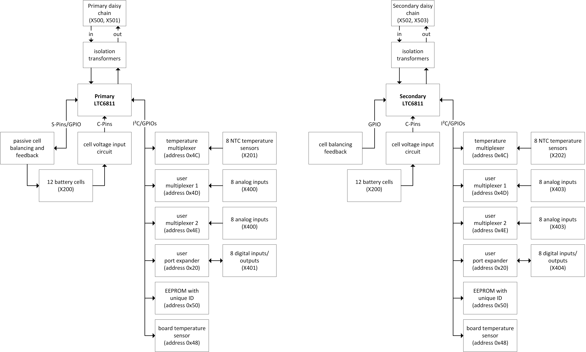

.. include:: ./../../../macros.txt
.. include:: ./../../../units.txt

.. _LTC6811_1_BASED_12_CELL_SLAVE____V2_1_6___AND_ABOVE_:

LTC6811-1-based 12-Cell Slave (``v2.1.6`` and above)
====================================================

.. |local_slave_version_start|  replace:: ``2.1.6``
.. |local_slave_version|  replace:: ``above``

--------
Overview
--------

.. important::

   The following description only applies for the |ltc6811-1|\ -based 12 cell
   |BMS-Slave| hardware versions |local_slave_version_start| to
   |local_slave_version|.

.. hint::

   All connector pinouts described below follow the
   :ref:`CONVENTION_FOR_CONNECTOR_PIN_NUMBERING`.

^^^^^^^^^^^^^
Block Diagram
^^^^^^^^^^^^^

The block diagram of the |BMS-Slave| is shown in
:numref:`Fig. %s <block_diagram_6811-1_slave_12cell_v2.1.6>`

.. _block_diagram_6811-1_slave_12cell_v2.1.6:

   |BMS-Slave| 12-Cell Block Diagram

^^^^^^^^^^^^^^^^^^^^^^^^^^
Schematic and Board Layout
^^^^^^^^^^^^^^^^^^^^^^^^^^

More information about the board schematic and layout files can be found in
section :ref:`DESIGN_RESOURCES`.

^^^^^^^^^^^^^^^^^^^^^
Mechanical Dimensions
^^^^^^^^^^^^^^^^^^^^^

The size of the PCB is 160x100mm.

---------
Functions
---------

The following general description applies to both, the primary and the
secondary of the |BMS-Slave|.
If there are any differences in hardware between the primary and the secondary
they will be marked as such.

^^^^^^^^^^^^^^^^^^^^^^^^
Cell Voltage Measurement
^^^^^^^^^^^^^^^^^^^^^^^^

The cell voltage sense lines are input on the connector X200.
The pinout is described in
:numref:`Table %s <6811-1_slave_12cell_v2.1.6_cell_sense_connector>`.

.. csv-table:: Cell voltage sense connector
   :name: 6811-1_slave_12cell_v2.1.6_cell_sense_connector
   :header-rows: 1
   :delim: ;
   :file: ./12-ltc-ltc6811-1-v2.1.6/12-ltc-ltc6811-1-v2.1.6_cell-voltage-sense-connector.csv

Each of these lines is protected by a 250mA fast fuse surface mount device
(F301 - F313) on the board except of the |VBAT+| and |VBAT-| lines which are
protected by a value of 500mA (F300 and F314).
This is especially important for a test environment.
The |VBAT+| and |VBAT-| connections are used for the internal power supply of
the |BMS-Slave| board.
If the battery module does not contain these separate wires to the positive and
negative module terminals, the solder jumpers SJ401 and SJ402 have to be
shorted.
In this case the power required by the |BMS-Slave| will be supplied through the
sense lines |CELL_0-| and |CELL_11+|.
Running the |BMS-Slave| in this configuration could result in cell measurement
errors due to voltage drop over the sense wires.

The cell input lines are filtered by a grounded or differential capacitor
filter:
both possibilities are provided on the PCB of the |BMS-Slave|.
More information on the corner frequency of this filtering can be found in the
schematic.
The grounded capacitor filter should be used in environments affected with a
high noise as it offers a high level of battery voltage ripple rejection.
The differential capacitor filter can be used when noise is less frequent or
the design is subjected to cost optimization.

^^^^^^^^^^^^^^^^^^^^^^
Passive Cell Balancing
^^^^^^^^^^^^^^^^^^^^^^

The passive balancing circuit is realized by a parallel connection of two
68 |Ohm| discharge resistors that can be connected to each single cell in
parallel.
The MOSFET switches (T1500 - T1511) that control the connection to the cells
are controlled by the primary |ltc6811-1| monitoring IC.
The secondary |ltc6811-1| does not support balancing.
The resistor value of 2x 68 |Ohm| results in a balancing current of about 100mA
at a cell voltage of 3.6V.
This current results in a power dissipation of about 0.36W per balancing
channel (at 3.6V).

^^^^^^^^^^^^^^^^^^^^^^^^^^^^^^
Global Cell Balancing Feedback
^^^^^^^^^^^^^^^^^^^^^^^^^^^^^^

In order to check the proper function of the balancing process or to detect a
malfunction in the balancing circuit, a global balancing feedback signal is
connected to the |ltc6811-1|.
This allows the |BMS-Master| to check whether any balancing action is currently
taking place.
The feedback signal is connected to the GPIO3 of the |ltc6811-1|.
The signal remains in a logic zero state until any balancing action on at least
one cell in the module starts.

^^^^^^^^^^^^^^^^^^^^^^^^^^^^^^
Temperature Sensor Measurement
^^^^^^^^^^^^^^^^^^^^^^^^^^^^^^

The cell temperature sensors are connected to the connectors X201 (primary)
and X202 (secondary).
The pinout is identical for the primary and secondary and is described in
:numref:`Table %s <6811-1_slave_12cell_v2.1.6_temp_sense_connector>`.

.. csv-table:: Temperature sensor connector
   :name: 6811-1_slave_12cell_v2.1.6_temp_sense_connector
   :header-rows: 1
   :delim: ;
   :file: ./12-ltc-ltc6811-1-v2.1.6/12-ltc-ltc6811-1-v2.1.6_temperature-sensor-connector.csv

Standard 10\ |kOhm| NTC resistors are recommended for use.
When using other values than these, the series resistors
(R100-1/2 to R107-1/2) on the board may have to be adjusted.
Please note that the accuracy of the internal voltage reference VREF2 decreases
heavily with a load of over 3mA.
Using 8x 10\ |kOhm| NTC resistors with the corresponding 10\ |kOhm| series
resistors results in a current of 1.2mA (at 20°C) which is drawn from VREF2.

Each of the 8 temperature sensors are connected to an analog multiplexer.
The analog multiplexer can be controlled via |I2C| by the |ltc6811-1|
(7-bit address: 0x4C).
In order to ensure fast settling times after switching the multiplexer input,
the output signal of the multiplexer is buffered by an operational amplifier.
Finally the analog voltage of the selected sensor is measured on the GPIO1 pin
of the |ltc6811-1|.

^^^^^^^^^^^^^^^
On-board EEPROM
^^^^^^^^^^^^^^^

.. attention::

   The |BMS-Slave| hardware versions ``2.1.0`` and above use a different
   EEPROM IC (ST M24M02) than all other previous hardware versions.

The primary as well as the secondary unit of the |BMS-Slave| board is equipped
with an EEPROM (IC800-1/2).
The EEPROM for example can be used for storing data such as calibration values
or minimum and maximum temperatures seen by the module during its lifetime.
Similar to the analog multiplexers, the EEPROM device is connected to the
|I2C| bus of the |ltc6811-1| (7-bit address: 0x50).

^^^^^^^^^^^^^^^^^^^^^^^^^^^^^^^^^^^
On-board Ambient Temperature Sensor
^^^^^^^^^^^^^^^^^^^^^^^^^^^^^^^^^^^

For an additional monitoring of the ambient temperature an on-board temperature
sensor is used.
This temperature sensor can be read by the |ltc6811-1| via the |I2C| bus
(7-bit address: 0x48).
It is possible to program an alert temperature level.
Once the measured temperature reaches this alert temperature level, the alert
pin of the IC is set to a logic low level.
Currently, this signal is not used on the |BMS-Slave| board, but it is
accessible on the connector X402.

^^^^^^^^^^^^^^^^^^^^^^^^^^^^^
Additional Inputs and Outputs
^^^^^^^^^^^^^^^^^^^^^^^^^^^^^

Several additional analog and digital inputs and outputs are provided on the
|BMS-Slave| board via pin headers.
Each 16 analog inputs are provided on connector X400 (primary) and X403
(secondary).
The pinout for the connectors for the primary and secondary unit is identical
and is described in
:numref:`Table %s <6811-1_slave_12cell_v2.1.6_analog_in_connector>`.

.. csv-table:: Connector for analog inputs
   :name: 6811-1_slave_12cell_v2.1.6_analog_in_connector
   :header-rows: 1
   :delim: ;
   :file: ./12-ltc-ltc6811-1-v2.1.6/12-ltc-ltc6811-1-v2.1.6_analog-inputs-connector.csv

Each 8 analog inputs are connected to an analog multiplexer.
The analog multiplexers can be controlled via |I2C| by the |ltc6811-1|
(7-bit addresses: 0x4D and 0x4E).
In order to ensure fast settling times after switching the multiplexer input,
the output signals of the multiplexers are buffered by operational amplifiers.
Finally the analog voltage of the selected sensor can be measured on the GPIO2
pin of the |ltc6811-1|.

Each 8 digital inputs/outputs are provided on the connectors X401 (primary)
and X404 (secondary).
The pinout for the connectors for the primary and secondary unit is identical
and is described in
:numref:`Table %s <6811-1_slave_12cell_v2.1.6_digital_io_connector>`.

.. csv-table:: Connector for digital IOs
   :name: 6811-1_slave_12cell_v2.1.6_digital_io_connector
   :header-rows: 1
   :delim: ;
   :file: ./12-ltc-ltc6811-1-v2.1.6/12-ltc-ltc6811-1-v2.1.6_digital-io-connector.csv

Each 8 digital inputs/outputs are connected to an |I2C| controlled port
expander (7-bit address: 0x20).
The direction of the inputs/outputs as well as the logic levels on the pins can
be selected by register settings.
Each of the 8 digital inputs/outputs has a discrete pull up resistor that for
example can be used for directly connecting a tactile switch.

^^^^^^^^^^^^^^^^^^^^^^^^^^^^^
isoSPI Daisy Chain Connection
^^^^^^^^^^^^^^^^^^^^^^^^^^^^^

The data transmission between the slaves and between the slaves and the basic
board takes place using the isoSPI interface.
The isoSPI signals are input on the connectors X500 (primary) and X502
(secondary).
The isoSPI signals for daisy-chaining are output on the connectors X501
(primary) and X503 (secondary).
The isoSPI connections are isolated galvanically using pulse transformers
(TR1400-1/2).
The voltage amplitude of the differential signal can be adjusted by setting
resistors (see paragraph :ref:`hw_slave_daisy_current_12cell_v2.1.6`).

The pinout of the isoSPI connectors is described in
:numref:`Table %s <6811-1_slave_12cell_v2.1.6_daisy_input_connectors>` and
:numref:`Table %s <6811-1_slave_12cell_v2.1.6_daisy_output_connectors>`.

.. csv-table:: isoSPI Daisy Chain Input Connectors
   :name: 6811-1_slave_12cell_v2.1.6_daisy_input_connectors
   :header-rows: 1
   :delim: ;
   :file: ./12-ltc-ltc6811-1-v2.1.6/12-ltc-ltc6811-1-v2.1.6_daisy-input-connectors.csv

.. csv-table:: isoSPI Daisy Chain Output Connectors
   :name: 6811-1_slave_12cell_v2.1.6_daisy_output_connectors
   :header-rows: 1
   :delim: ;
   :file: ./12-ltc-ltc6811-1-v2.1.6/12-ltc-ltc6811-1-v2.1.6_daisy-output-connectors.csv

^^^^^^^^^^^^^^^^^^^^^^^^^^^
Hardware Settings / Options
^^^^^^^^^^^^^^^^^^^^^^^^^^^

Software Timer
""""""""""""""

The internal software timer of the |ltc6811-1| can be enabled/disabled by a
dedicated external pin (SWTEN, pin 36 of the |ltc6811-1|).
In order to support all features, the |BMS-Slave| board offers a possibility to
switch the software timer.
The software timer is enabled in the standard configuration, which means pin 36
is pulled to VREG via a zero-ohm resistor (R221/R321).
The timer can be disabled by removing the resistor R1402-1/2 and placing a
zero-ohm resistor to R1403-1/2.

.. _hw_slave_daisy_current_12cell_v2.1.6:

Daisy Chain Communication Current
"""""""""""""""""""""""""""""""""

The daisy chain communication current can be set by the resistors R1419-1/2 and
R1421-1/2.
The default value is 820 |Ohm| for R14211/2 and 1.21\ |kOhm| for R1419-1/2.
This values result in a bias current of approximately 1mA and a differential
signal amplitude of 1.18V.
Theses values are suitable for high noise environments with cable lengths of
over 50m.
More information can be found in the |ltc6811-1| data sheet.

Status LED
""""""""""

The status LEDs LD1400-1/2 show the current mode of each, the primary and
secondary |ltc6811-1|.
The LED is on in STANDBY, REFUP or MEASURE mode, whereas the LED is off in
SLEEP mode.
The LED can be disabled by removing the resistor R1407-1/2.

GPIO Extension Connector
""""""""""""""""""""""""

The internal GPIO lines of the primary or secondary |ltc6811-1| can be
connected to the GPIO extension pin header X402 via optional zero-ohm
resistors.
In the standard configuration these resistors are not placed.
Of course it is possible to place each both resistors for a parallel connection
of the internal signals to the GPIO extension connector.
The placement of the resistors and the resulting connection is shown in
:numref:`Table %s <6811-1_slave_12cell_v2.1.6_gpio_extension_connector>`.

.. csv-table:: GPIO extension connector
   :name: 6811-1_slave_12cell_v2.1.6_gpio_extension_connector
   :header-rows: 1
   :delim: ;
   :file: ./12-ltc-ltc6811-1-v2.1.6/12-ltc-ltc6811-1-v2.1.6_gpio-extension-connector.csv

The pinout of the extension connector X402 is described in
:numref:`Table %s <6811-1_slave_12cell_v2.1.6_extension_connector>`.

.. csv-table:: Extension connector
   :name: 6811-1_slave_12cell_v2.1.6_extension_connector
   :header-rows: 1
   :delim: ;
   :file: ./12-ltc-ltc6811-1-v2.1.6/12-ltc-ltc6811-1-v2.1.6_extension-connector.csv

^^^^^^^^^^^^^^^^^^^^^^^^^^^^^^
External Isolated |DC-| Supply
^^^^^^^^^^^^^^^^^^^^^^^^^^^^^^

.. note::

   The external isolated |DC-| supply is only available in the |BMS-Slave|
   hardware versions ``2.1.0`` and above.

It is possible to supply the |BMS-Slave| by an external DC power supply with a
voltage range of 8V to 24V.
The DC input is protected against reverse voltage and over-current
(with a 1.25A fuse).
The external DC supply has to be connected on connector X1001 or X1002 (both
connectors are in parallel for daisy chaining the supply).
The pinout of the connectors X1001 and X1002 is shown in
:numref:`Table %s <6811-1_slave_12cell_v2.1.6_external_dc_supply_connector>`.

.. csv-table:: External DC supply connector
   :name: 6811-1_slave_12cell_v2.1.6_external_dc_supply_connector
   :header-rows: 1
   :delim: ;
   :file: ./12-ltc-ltc6811-1-v2.1.6/12-ltc-ltc6811-1-v2.1.6_external-dc-supply-connector.csv
