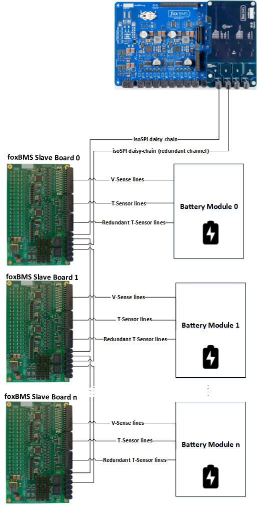

.. include:: ./../macros.txt
.. include:: ./../units.txt

.. _THE_FOXBMS_2_PLATFORM:

#####################
The foxBMS 2 Platform
#####################

The |foxbms| platform consists of two main elements:

- the |master| and
- the |slave|.

The |master| consists of 3 boards:

- the |bms-master|,
- the |bms-interface| and
- the |bms-extension|.

An ARM-based microcontroller (`Cortex-R5`_) is used on the |bms-master|.

The |bms-master| communicates with the outside world via a CAN bus. The current
flowing through the battery system is measured via a current sensor
connected to a CAN bus. The current sensor is controlled via CAN by the
|bms-master| and sends the resulting measurement via CAN.

The |slaves| (based on |bms-slaves|) are used to measure cell voltages and
cell temperatures in the battery modules. The |slaves| can be linked in series.

In order for the |master| to communicate with the |slaves|, an interface board
(|bms-interface|) is needed. It implements the physical layer of the
communication between the |bms-master| and the |slaves|.

Control requests to the |master| are made via CAN messages. They control the
externally facing behavior of the system such as opening and closing the
contactors based on the internal implementation. The |master| measures
the state of the battery system and decides based on the implemented
algorithms the state of the contactors. The measured system state is
additionally communicated through CAN messages to a superior control unit.

The |bms-master| also implements an interlock line. This is a fast acting
interface that has to be connected through crucial system components such as
the |master|, emergency stop switch, master service disconnect switches and
similar devices. The interlock line can be opened by any connected device.
It is possible to define a system behavior in the case that the interlock line
has been opened such as the transition to an application-specific safe-state,
which could be the opening of all contactors.

See :numref:`start-high-level`.

   High level overview of |foxbms|

In the case that an application requires more inputs, outputs or specific
hardware functions, these can be implemented through a |bms-extension|.
This is a specialized board that connects through a set of connectors to
the |bms-master| and can implement application-specific hardware for the
|master|.

This description reflects the current state of |foxbms|. Due to the open nature
of the system, many other possibilities can be implemented, like for example:

- Use of other types of current sensors (e.g., shunt-based or Hall-effect
  based)
- No |slave| needs to be used: a direct measurement of the cell voltages and
  cell temperatures can be performed by the |master|
- A higher number of contactors can be controlled (e.g., up to 9)
- etc...

.. _Cortex-R5:
   https://developer.arm.com/ip-products/processors/cortex-r/cortex-r5
