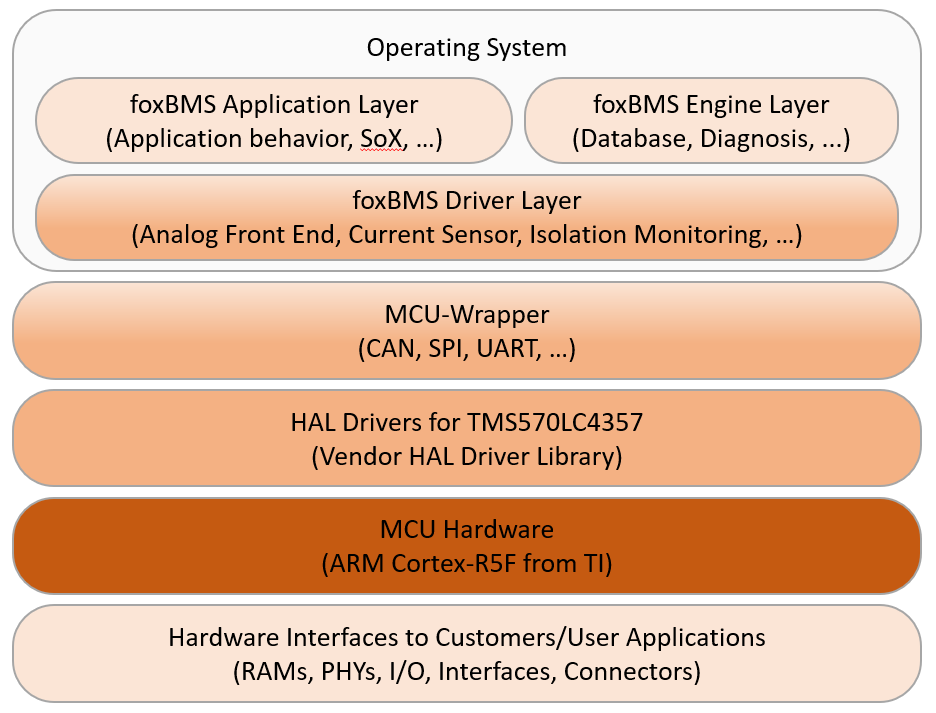
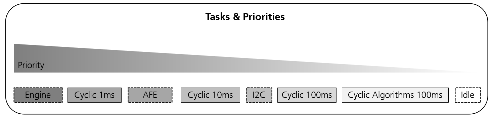
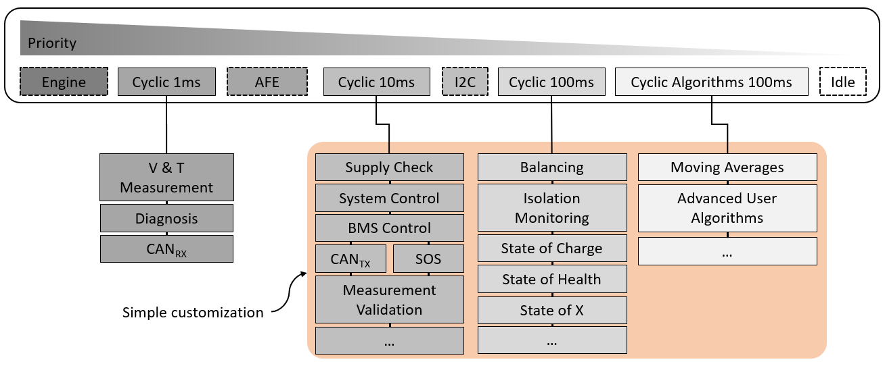
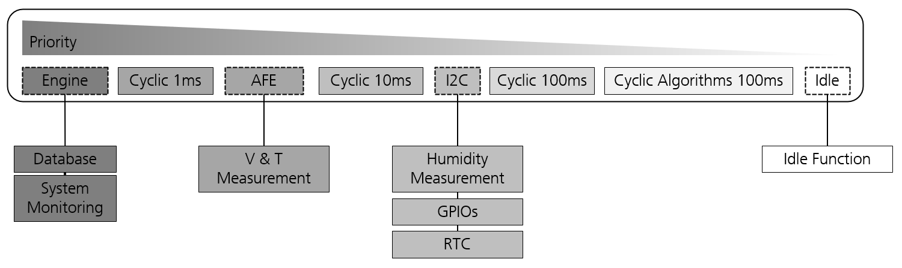

.. include:: ./../../macros.txt
.. include:: ./../../units.txt

.. _SOFTWARE_ARCHITECTURE:

#####################
Software Architecture
#####################

The following section describes the diagnostics and safety focused BMS software
architecture as depicted in :numref:`sw-architecture`.
This layer-based architecture facilitates hardware and operating independent
BMS implementations applying the design paradigms, that

- **All application code runs in a simple operating system context** and
- **MCU and external hardware dependent drivers are abstracted by the provided
  wrappers/abstraction layers.**

   |foxbms| - Software architecture

A **hardware abstraction layer (HAL)** provides various interfaces to directly
access the hardware and its peripherals.
This enables encapsulation of the actual BMS software implementation from the
hardware and eases porting the |foxbms| software to different microcontrollers.

The open-source real-time operating system |freertos| is the centerpiece of
the software architecture.
Its reliable kernel is ideally suited to ensure the compliance of all soft and
hard real-time requirements of a battery-management system.
Furthermore, it provides a migration path to SafeRTOS, which includes
certifications for the medical, automotive and industrial sector, if a
certification is required by the application.

The |foxbms| software itself, executed within the operating system context, is
grouped into three different layers:

- A dedicated **foxBMS Driver Layer** uses the MCU-Wrapper to provide different
  communication interfaces (e.g., CAN, UART, SPI) to acquire measurement data,
  monitor status of hardware components (e.g., supply voltages, transceivers,
  real-time clock) as the well ass the communication with the |bms-slaves|.
- Diagnostic functions and error handling, system monitoring (for hard- and
  software) and interfaces to the data-exchange module are the most important
  tasks of the **foxBMS Engine Layer**.
  The data-exchange module, sometimes also called database ensures a reliable
  and safe asynchronous data exchange between different tasks and/or software
  modules.
  It is implemented based on a producer/consumer pattern.
  The exchanged data is always produced by a single data producer and then
  stored in the data-exchange module.
  Afterwards, it can be used by multiple consumers while the data integrity is
  always ensured.
- The actual BMS implementation including the monitoring of the safety critical
  parameters (e.g., safe-operating area, contactor state, communication
  errors), state estimation functionalities (e.g., state-of-charge, state-of-
  health, state-of-energy) and the application specific BMS application
  (e.g., balancing, plausibility checks) are implemented within the
  **foxBMS Application Layer**.
  Additionally, an algorithm module provides an interface to execute advanced
  computation intensive algorithms.

As previously stated, one design paradigm is that all application code runs
within the context of an operating system.
In detail, this means that various tasks with different priorities are used to
ensure the necessary real-time behavior of the BMS as shown in
:numref:`sw-tasks-priorities`.

   |foxbms| Tasks & Priorities

Two different task implementations are used:

- **Cyclic executed task in non-blocking mode with a fixed period (1ms, 10ms,
  100ms)**
- **Consecutive running task in blocking-mode**

Four scheduled tasks with a period of 1\ |ms|, 10\ |ms|, and 100\ |ms|, are
configured to execute the various deterministic finite-state machines that
describe the behavior of the BMS as shown in :numref:`sw-tasks-cyclic`.

   |foxbms| Task Model - Cyclic Tasks

Time-sensitive software modules (e.g., diagnostics, measurement, CAN reception)
are called within the **Cyclic 1ms** task, whereas less
time critical modules (e.g., CAN transmission, interlock, BMS) are implemented
inside the **Cyclic 10ms** task.
Software modules that are temporally uncritical (e.g., state estimation,
balancing) are handled by the **Cyclic 100ms** task.
The additional **Cyclic Algorithms 100ms** task can be used for advanced
user specific algorithms (e.g., moving averages, computation intensive state
estimation algorithms).

Additional functionality is provided in through continuous running tasks
that are implemented in blocking-mode.
This means, that the detailed function implementation in these tasks defines
the actual timing behavior (e.g., running time, blocking duration).
The continuous running tasks are shown in
:numref:`sw-tasks-continuous-blocking`.

   |foxbms| Task Model - Continuous Running Tasks

The **Engine** task is used to implement a data-exchange layer between the
different tasks and processes.
This data-exchange layer runs with the highest priority of all tasks and is
interfaced using queues to either send or to receive data entries.
These |freertos| queues are formally verified for memory safety, thread safety
and functional correctness.
Depending on the selected AFE, the respective driver is either implemented as
non-blocking variant (executed in the Cyclic 1\ |ms| task) or blocking and
then running in the **AFE** task.
All drivers for hardware peripherals with an |I2C| interface on the
|foxbms-bms-master| are called within the **I2C** task.
The **IDLE** task is executed if all other tasks are currently blocked or are
waiting to be executed again.
