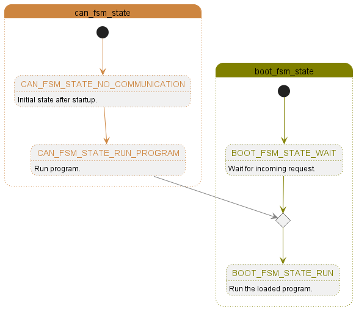
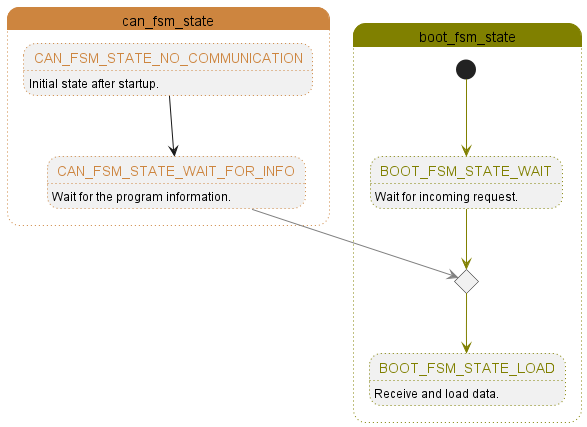
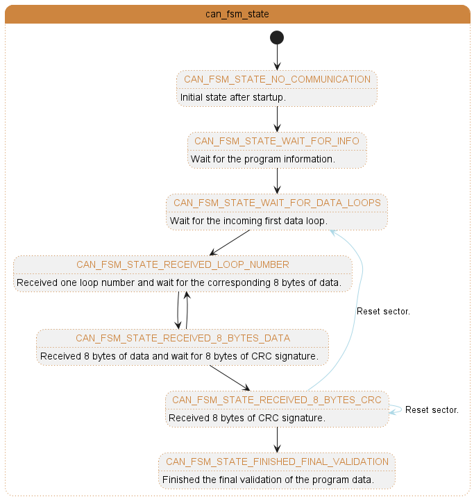
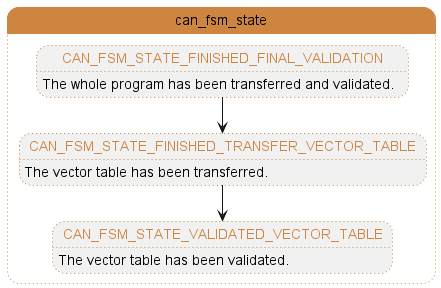

.. include:: ./../../macros.txt

.. _BOOTLOADER:

##########
Bootloader
##########

Description
-----------

A `bootloader <https://de.wikipedia.org/wiki/Bootloader>`__
is a program to load initialization code.
In our case, it is the initial segment of the program located at the start of
the flash of the microcontroller (|ti-tms570lc4357|), and its primary purpose
is to update the |foxbms| application via interfaces like CAN on the fly
without the use of a debugger.

This bootloader provides four basic functions:

- transferring the application
- running the application
- resetting the boot process
- checking the status of the onboard bootloader

Transferring the Application
^^^^^^^^^^^^^^^^^^^^^^^^^^^^

To transfer the application binary to |bms-master|, the binary file first needs
to be parsed into small sections, and a CRC signature will be calculated for
each section.
('section' in this context refers to a data block that can be stored in a
single flash sector of the physical flash memory.)
During transferring, the data sections will be sent one by one.
Once a section transfer is completed, the program section will be written into
its relevant flash space, and an onboard CRC signature will be calculated.

Next, the CRC signature for this program section will be sent and compared with
the onboard calculated CRC signature to ensure the flashed section data is
correct.
If the result is true, the next section will be transferred.
Otherwise, the onboard bootloader will wait for the same section data again.

Once all section data has been sent successfully, the CRC signature of the last
section, which is also the CRC signature of the entire application binary, will
be saved into the flash memory where the program information is stored.
After that, the vector table will be sent, and a CRC signature for this vector
table will also be sent to verify its validity.
The availability flag of the program will be set only if the CRC signatures of
the vector table from both the PC side and the |bms-master| side match.

Running the Application
^^^^^^^^^^^^^^^^^^^^^^^

Once the bootloader receives the run command via a communication interface like
CAN, it will load the program information from the last loading session into a
global structure variable and check its availability flag to see if a program
exists.

If a program exists, an onboard CRC calculation will be performed based on the
start address and length of the program contained in the variable that carries
the program information.
The obtained CRC signature will then be compared with the one saved during the
previous loading session to verify the program's validity.

If the onboard program is valid, the bootloader will jump to the application's
init function.
Otherwise, it will inform the PC that there is no valid
program available onboard.

Resetting the Boot Process
^^^^^^^^^^^^^^^^^^^^^^^^^^

If a reset boot process command is received by the bootloader via CAN, the
global structure variable that carries the program information will first be
reset and updated to flash.
After that, the CAN communication-related variables will be reset, and the RAM
will be cleaned up.
Additionally, the flash banks where the application data is supposed to be
written will be erased, and a software reset will be performed to reset the
MCU.

Checking the Status of the Onboard Bootloader
^^^^^^^^^^^^^^^^^^^^^^^^^^^^^^^^^^^^^^^^^^^^^

The command to check the status of the bootloader will trigger the bootloader's
callback functions to retrieve its status, including the boot FSM status and
the CAN FSM status, which represent the status of the boot process and the
CAN module, respectively.
This can be used to verify if the connection (e.g., CAN) between the PC
and the bootloader is error-free and to check if the bootloader program is
successfully running on the |bms-master|.

Project Structure
-----------------

This bootloader project contains two parts: the bootloader itself and the PC
program, which communicates with the bootloader (e.g., send the newest binary
file of |foxbms| to |bms-master|).

.. table:: C Part (On-board code)
   :name: c-part-on-board-code
   :widths: grid

   +-----------------------------+--------------------------------------------+
   | Module                      | Description                                |
   +=============================+============================================+
   | driver                      | Contains low level driver modules to       |
   |                             | control the on-board resources.            |
   +-----------------------------+--------------------------------------------+
   | engine                      | Contains mid-level engine modules to       |
   |                             | control the overall program flow.          |
   +-----------------------------+--------------------------------------------+
   | hal                         | Contains the build script and the hash     |
   |                             | code for HALCoGen.                         |
   +-----------------------------+--------------------------------------------+
   | main                        | Contains the files where the 'main'        |
   |                             | function and '_c_int00' function are       |
   |                             | located.                                   |
   |                             | In addition, it also contains the linker   |
   |                             | script for configuring the memory          |
   |                             | distribution and the files supported at    |
   |                             | the system level.                          |
   +-----------------------------+--------------------------------------------+

.. table:: Python Part (PC-side code)
   :name: python-part-pc-side-code
   :widths: grid

   +-----------------------------+--------------------------------------------+
   | Module                      | Description                                |
   +=============================+============================================+
   | bootloader.py               | Contains the Bootloader class, which       |
   |                             | serves as the main entry point for         |
   |                             | sending application data or requests to    |
   |                             | the bootloader.                            |
   +-----------------------------+--------------------------------------------+
   | bootloader_can.py           | Contains the BootloaderInterfaceCan class, |
   |                             | which enables high-level communication     |
   |                             | with the bootloader via CAN.               |
   +-----------------------------+--------------------------------------------+
   | bootloader_can_basics.py    | Contains the BootloaderCanBasics class,    |
   |                             | where the basic CAN communication          |
   |                             | functions, including sending and receiving |
   |                             | specified messages, are implemented.       |
   +-----------------------------+--------------------------------------------+
   | bootloader_binary_file.py   | Contains the BootloaderBinaryFile class,   |
   |                             | responsible for managing the application   |
   |                             | binary file and providing functions to     |
   |                             | perform operations on it, such as          |
   |                             | calculating CRC, extracting data, and      |
   |                             | more.                                      |
   +-----------------------------+--------------------------------------------+
   | bootloader_can_messages.py  | Contains all enums of CAN messages and     |
   |                             | functions to get specified CAN messages in |
   |                             | a dictionary.                              |
   +-----------------------------+--------------------------------------------+

How to use it
-------------

To build the bootloader binary, use the command variant
``build_bootloader_embedded``.
After the binary is successfully built, you can flash it onto the |bms-master|
board using a debugger.
Once the binary is flashed, you can control it using commands available in the
fox tool's CLI.
There are four commands can be used to communicate the bootloader:

#. Check the status of the bootloader:

   .. tabs::

      .. group-tab:: Win32/PowerShell

         .. code-block:: powershell

            .\fox.ps1 bootloader check -vv

      .. group-tab:: Win32/cmd.exe

         .. code-block:: bat

            fox.bat bootloader check -vv

      .. group-tab:: Win32/Git bash

         .. code-block:: shell

            ./fox.ps1 bootloader check -vv

      .. group-tab:: Linux

         .. code-block:: shell

            ./fox.ps1 bootloader check -vv

#. Load the |foxbms| binary into the flash memory of |bms-master|:

   .. tabs::

      .. group-tab:: Win32/PowerShell

         .. code-block:: powershell

            .\fox.ps1 bootloader load-app -vv

      .. group-tab:: Win32/cmd.exe

         .. code-block:: bat

            fox.bat bootloader load-app -vv

      .. group-tab:: Win32/Git bash

         .. code-block:: shell

            ./fox.ps1 bootloader load-app -vv

      .. group-tab:: Linux

         .. code-block:: shell

            ./fox.ps1 bootloader load-app -vv

#. Run the |foxbms| application on |bms-master|:

   .. tabs::

      .. group-tab:: Win32/PowerShell

         .. code-block:: powershell

            .\fox.ps1 bootloader run-app -vv

      .. group-tab:: Win32/cmd.exe

         .. code-block:: bat

            fox.bat bootloader run-app -vv

      .. group-tab:: Win32/Git bash

         .. code-block:: shell

            ./fox.ps1 bootloader run-app -vv

      .. group-tab:: Linux

         .. code-block:: shell

            ./fox.ps1 bootloader run-app -vv

#. Reset the boot process:

   .. tabs::

      .. group-tab:: Win32/PowerShell

         .. code-block:: powershell

            .\fox.ps1 bootloader reset -vv

      .. group-tab:: Win32/cmd.exe

         .. code-block:: bat

            fox.bat bootloader reset -vv

      .. group-tab:: Win32/Git bash

         .. code-block:: shell

            ./fox.ps1 bootloader reset -vv

      .. group-tab:: Linux

         .. code-block:: shell

            ./fox.ps1 bootloader reset -vv

In the case of an error status, a reset command or a power-on restart
should resolve the problem.

Memory Configuration
--------------------

The microcontroller (|ti-tms570lc4357|) has two independent flash banks.
Each of them consists of 16 sectors and has a storage area of 2MB.
While the sizes of the sectors in the second flash bank are uniform, the sizes
of the sectors in the first flash bank are not identical.
More details can be found in
`Technical Reference Manual of TMS570LC43 <https://www.ti.com/lit/ug/spnu563a/spnu563a.pdf?ts=1725549128780&ref_url=https%253A%252F%252Fwww.ti.com%252Fproduct%252FTMS570LC4357%253FHQS%253Dti-null-null-verifimanuf_manuf-manu-pf-octopart-wwe>`__
.

In this project, the flash memory (from ``0x0x00000000`` to ``0x00400000``)
has been divided into 5 regions, as shown in :numref:`memory-configuration`.
The initial vector table is saved in the memory labeled
``VECTORS_DIRECT``, and the second vector table, where the actual exception
entries are implemented, is saved in the memory labeled
``VECTORS_INDIRECT``.
More details about the vector tables can be found in :ref:`about_vector_table`.

The program of bootloader (except for its vector table) has been saved in the
memory labeled ``BOOTLOADER``.
The binary of |foxbms| is supposed to be put in the memory labeled ``APP``.
The information of the program will be saved to memory labeled
``PROGRAM_INFO_AREA``.

In this project, the RAM of the microcontroller is configured as shown in
:numref:`memory-configuration`.
As the names indicate, the memory labeled ``STACK`` refers to the space
allocated for stack usage, while the memory labeled ``RAM`` serves as the
general RAM space.

The memory labeled ``RAM_FLASH`` serves as the section buffer to temporarily
store transferred data before it is written to flash sector.
The flash-related functions and libraries will run from the memory labeled
``RAM_FLASH_API``.
More details can be found in :ref:`how_to_load_flash_api_to_sram`.

The memory labeled with the 'ECC' prefix is where the calculated error
correction codes (ECC) are saved.
More details about the ECC can be found in
`Technical Reference Manual of TMS570LC43 <https://www.ti.com/lit/ug/spnu563a/spnu563a.pdf?ts=1725549128780&ref_url=https%253A%252F%252Fwww.ti.com%252Fproduct%252FTMS570LC4357%253FHQS%253Dti-null-null-verifimanuf_manuf-manu-pf-octopart-wwe>`__
.

.. table:: Memory Configuration
   :name: memory-configuration
   :widths: grid
   :align: center

   +--------------------------+----------------+-------------------+--------+----------------+
   | NAME                     | ORIGIN         | LENGTH            | ATTR   | FILL           |
   +==========================+================+===================+========+================+
   | ``VECTORS_DIRECT``       | ``0x00000000`` | ``0x00000020``    | ``X``  | ``0xFFFFFFFF`` |
   +--------------------------+----------------+-------------------+--------+----------------+
   | ``BOOTLOADER``           | ``0x00000020`` | ``0x00017FE0``    | ``RX`` | ``0xFFFFFFFF`` |
   +--------------------------+----------------+-------------------+--------+----------------+
   | ``PROGRAM_INFO_AREA``    | ``0x00018000`` | ``0x00007FE0``    | ``RX`` | ``0xFFFFFFFF`` |
   +--------------------------+----------------+-------------------+--------+----------------+
   | ``VECTORS_INDIRECT``     | ``0x0001FFE0`` | ``0x00000020``    | ``X``  | ``0xFFFFFFFF`` |
   +--------------------------+----------------+-------------------+--------+----------------+
   | ``APP``                  | ``0x00020000`` | ``0x003E0000``    | ``RX`` | ``0xFFFFFFFF`` |
   +--------------------------+----------------+-------------------+--------+----------------+
   | ``STACK``                | ``0x08000000`` | ``0x00010000``    | ``RW`` |                |
   +--------------------------+----------------+-------------------+--------+----------------+
   | ``RAM``                  | ``0x08010000`` | ``0x00020000``    | ``RWX``|                |
   +--------------------------+----------------+-------------------+--------+----------------+
   | ``RAM_FLASH``            | ``0x08030000`` | ``0x00040000``    | ``RWX``|                |
   +--------------------------+----------------+-------------------+--------+----------------+
   | ``RAM_FLASH_API``        | ``0x08070000`` | ``0x00010000``    | ``RWX``|                |
   +--------------------------+----------------+-------------------+--------+----------------+
   | ``ECC_VECTORS_DIRECT``   | ``0xF0400000`` | ``0x00000004``    | ``R``  |                |
   +--------------------------+----------------+-------------------+--------+----------------+
   | ``ECC_BOOTLOADER``       | ``0xF0400004`` | ``0x00002FFC``    | ``R``  |                |
   +--------------------------+----------------+-------------------+--------+----------------+
   | ``ECC_PROGRAM_INFO_AREA``| ``0xF0403000`` | ``0x00000FFC``    | ``R``  |                |
   +--------------------------+----------------+-------------------+--------+----------------+
   | ``ECC_VECTORS_INDIRECT`` | ``0xF0403FFC`` | ``0x00000004``    | ``R``  |                |
   +--------------------------+----------------+-------------------+--------+----------------+
   | ``ECC_APP``              | ``0xF0404000`` | ``0x0007C000``    | ``R``  |                |
   +--------------------------+----------------+-------------------+--------+----------------+

Communication Between PC and Bootloader
---------------------------------------

The communication between the PC and CAN has been realized via pre-defined CAN
messages.
The complete data transfer process is as shown in
:numref:`communication_between_pc_and_bootloader`:

   .. figure:: img/communication_between_pc_and_bootloader.png
      :alt: Communication between PC and bootloader
      :name: communication_between_pc_and_bootloader
      :width: 80 %
      :align: center

      Communication between PC and bootloader

Workflow
--------

The workflow of the bootloader is achieved through the implementation of a boot
state machine and a CAN state machine.
While the CAN state machine controls the CAN communication and the correct
sequence of the data transfer process, the boot state machine controls the main
workflow of the bootloader.

Boot FSM State Machine
^^^^^^^^^^^^^^^^^^^^^^

As shown in the following figure, at the start of the program, the boot FSM
state will be initialized to ``BOOT_FSM_STATE_WAIT``.
From this state, the boot FSM state can change to ``BOOT_FSM_STATE_LOAD``,
``BOOT_FSM_STATE_RUN``, or ``BOOT_FSM_STATE_RESET``, in response to changes in
the CAN FSM state.

.. figure:: img/boot_fsm_state.png
   :name: boot_fsm_state
   :align: center
   :alt: Boot FSM state

   Boot FSM state

The following state diagram represents the change of states in the CAN module.
At the beginning, the CAN FSM state will be loaded with
``CAN_FSM_STATE_NO_COMMUNICATION``.
To run the program, a corresponding request will be sent to the bootloader via
the CAN bus.
Once the CAN module has received this CAN message, it will change its state to
``CAN_FSM_STATE_RUN_PROGRAM``.
If the boot state machine is in the expected state (``BOOT_FSM_STATE_WAIT``) at
this moment, a validation process will be started to check if the onboard
program is available and validated.
The program will start if everything is correct.

   Interaction between boot and CAN FSM in the case of a run command

If a reset request has been sent via CAN bus, the CAN FSM state will change to
``CAN_FSM_STATE_RESET_BOOT`` from any state.

.. figure:: img/can_boot_reset.png
   :name: can_boot_reset
   :align: center
   :alt: Interaction between boot and CAN FSM in the case of a reset command

   Interaction between boot and CAN FSM in the case of a reset command

If the incoming CAN message is to start a data transfer process, the CAN FSM
state will then change to ``CAN_FSM_STATE_WAIT_FOR_INFO``, and the boot FSM
state will change to ``BOOT_FSM_STATE_LOAD``.

   Interaction between boot and CAN FSM during program loading

Once the information of the program has been successfully transferred, the
state will change to ``CAN_FSM_STATE_WAIT_FOR_DATA_LOOPS``.
From this state, the data will be transferred.
To ensure the transferring data (8 bytes every time) is correct, a
corresponding loop number needs to be sent before the 8 data bytes in each
loop.
Only if the loop number is the one the CAN module expects, the data bytes will
be considered correct and will be written into the sector buffer.

To transmit the data efficiently and precisely, the whole program will be
divided into sectors.
Each sector contains the data that can be filled into the sector buffer.
One sector contains 16 sub-sectors.
Each sub-sector contains 1024 * 8 bytes and can be transferred by 1024 data
loops.

Every time a sub-sector has been transferred, an acknowledgment (ACK) message
will be sent to inform the data sender that the whole sub-sector has been
successfully received.
If a whole sector has been transferred and written into the sector buffer, the
corresponding flash sector will be written using the data that is temporarily
saved in the sector buffer.
Immediately, the written flash sector will be validated by comparing the
received CRC signature (8 bytes) with the onboard calculated CRC signature
(8 bytes).
If the result is invalid, the variables involved with data transfer and the
sector buffer will be reset to the original state at the start of the data
transfer for this sector.
The CAN FSM state will reset to either ``CAN_FSM_STATE_WAIT_FOR_DATA_LOOPS`` or
``CAN_FSM_STATE_RECEIVED_8_BYTES_CRC``.
Once all data has been received, written, and validated, the CAN FSM state will
be set to ``CAN_FSM_STATE_FINISHED_FINAL_VALIDATION``.

   Partial CAN FSM state changes

After the whole program has been received and validated, the vector table for
this program will be transferred and validated as well, as shown in the
following diagram:

   Partial CAN FSM state changes

The entire state diagram of the CAN FSM state machine is shown as follows:

.. figure:: img/can_fsm_state.png
   :name: can_fsm_state
   :align: center
   :alt: CAN FSM state

   CAN FSM state changes

The functionality of this state machine has been achieved through the calling
of functions inside the boot module, which basically checks the state of the
CAN module.

Developer Note
--------------

What should be considered/modified while configuring the memory?
^^^^^^^^^^^^^^^^^^^^^^^^^^^^^^^^^^^^^^^^^^^^^^^^^^^^^^^^^^^^^^^^

To configure the memory of the microcontroller (|ti-tms570lc4357|), several
parts need to be considered/configured:

#. The linker script of the application (|foxbms|) ``app.cmd``
   and ``app_hex.cmd``.
#. The linker script of the bootloader ``bootloader.cmd``.
#. The address jump between the first vector table and the second vector table,
   which is defined in ``boot_intvecs.asm``.
#. The corresponding macros defined in one bootloader header file
   : ``boot_cfg.h``.
#. The app size defined in ``cli/cmd_bootloader/app_constants.py`` inside the
   pc-side code of bootloader.

.. _about_vector_table:

About Vector Table
^^^^^^^^^^^^^^^^^^

The
`vector table <https://www.ti.com/lit/an/spna236/spna236.pdf?ts=1724301653744>`__
is usually placed at the start address (``0x00``) of the flash and has a length
of ``0x20``.
It contains 8 8 32-bit ARM instructions in our case.

In the bootloader, there are two vector tables (``VECTORS_DIRECT`` and
``VECTORS_INDIRECT``)
located at ``0x00`` and ``0x0001FFE0`` of the flash memory.
While the first vector table only reroutes to the undefined entry, the SVC
(supervisor call) entry, the prefetch entry, the data abort entry, and the
phantom interrupt entry, to these inside the second vector table
(``VECTORS_INDIRECT``), the real function entries to handle these entries are
implemented in the second vector table using
`b xxx <https://developer.arm.com/documentation/den0042/a/Exceptions-and-Interrupts/Exception-priorities/The-Vector-table>`__.

Different from these entries, the reset entry points always to the ``_c_int00``
function which will also be called first before any other functions.
The IRQ and FIQ interrupt table will be loaded by
`ldr pc,[pc,#-0x1b0] <https://developer.arm.com/documentation/den0042/a/Exceptions-and-Interrupts/Exception-priorities/The-Vector-table>`__
inside the first vector table.
The configuration and initialization of the vectored interrupt manager is done
in ``_c_int00`` by ``vimInit()``.

During booting, the ``_c_int00`` function is first called, but the actual
working exception entries (except for IRQ and FIQ) will be these inside the
second vector table.
After the application is loaded, the vector table of the application will
replace the second vector table.
This means that by jumping into the second vector table, the ``_c_int00``
function of the application will be called, where the configuration for, e.g.,
VIM will be reset for the application.
Meanwhile, the real entries for the exceptions will be replaced by the entries
shipped with the application.

Changing operation mode
^^^^^^^^^^^^^^^^^^^^^^^
Since some functions inside flash and CRC modules change values in the
protected flash area, such as register values, certain privileges need to be
claimed before calling these functions.

To raise the privilege, SVC handlers are implemented to change the value of
`the program status register <https://developer.arm.com/documentation/ddi0460/d/Programmers-Model/Program-status-registers?lang=en>`__.

.. _how_to_load_flash_api_to_sram:

How to load the "Flash API" into the SRAM?
^^^^^^^^^^^^^^^^^^^^^^^^^^^^^^^^^^^^^^^^^^

To erase and write the flash bank where the bootloader is located, the relevant
flash API and the functions that use the flash API need to be run from SRAM
rather than flash.
More details can be found in
`here <https://www.ti.com/lit/ug/spnu501h/spnu501h.pdf?ts=1725300688204>`__,
which is also called
`run-time relocation <https://software-dl.ti.com/codegen/docs/tiarmclang/compiler_tools_user_guide/compiler_manual/program_loading_and_running/run-time-relocation-stdz0694629.html#stdz0694629>`__.
To run program from SRAM, the following steps must be done:

#. Change the MPU configuration for the region from ``0x08000000`` to
   ``0x0807FFFF`` to ``PRIV_RW_USER_RW_EXEC`` to enable calling the functions
   in this area without triggering any error.
   More details can be found in
   `here <https://www.ti.com/lit/an/spna238/spna238.pdf?ts=1718810487618&ref_url=https%253A%252F%252Fwww.ti.com%252Fproduct%252FTMS570LC4357%253Fbm-verify%253DAAQAAAAJ_____32ivajprZvDL3z6rbQIE5s075poxTO-MCK52TSVps_v6YYqaPSWjYQ8ZJlLdypjTy-Tqv1nypZNJa1qxYZE777ZbDRShl_L8Q1uxIgT9PjWdBBcqMH_O4ldH-G8PpDeULXMzVm45DMrLCW8TZVoHk_o-JO4xL6_YoJ_V544VamYSzvz1R-2oBwOWyiZuirQHIT5IREJYlRnmJ7kRaSYlO-hR7Az-4W2mZbI37U0s3Gsu6HSHoGDeozZKUhPR2Nmjswq-T-k5BuK7K-96wpqYDwRG1TQDbKaZYJ1WRYw-Dk-Of3GwVAufbiX23E>`__
#. Configure loading the flash API and flash relevant functions to flash memory
   and run them from SRAM by using build-in link operators in linker script.
   More details can be found in
   `here <https://software-dl.ti.com/codegen/docs/tiarmclang/compiler_tools_user_guide/compiler_manual/linker_description/08_using_linker_generated_copy_tables/using-built-in-link-operators-in-copy-tables-stdz0757585.html>`__.

How to use the onboard CRC module in Semi-AUTO mode?
^^^^^^^^^^^^^^^^^^^^^^^^^^^^^^^^^^^^^^^^^^^^^^^^^^^^

The detailed information regarding CRC onboard module and the CRC algorithm
used in the CRC onboard module can be found in
`here <https://www.ti.com/lit/an/spna235/spna235.pdf>`__.

How to jump to a certain address?
^^^^^^^^^^^^^^^^^^^^^^^^^^^^^^^^^

When you run the code, the bootloader will start first because this is the
bootloader's reset vector that is on the first address ``0x0``.

The bootloader's main will jump into the application like this :

.. code:: c

   uint32_t boot_jumpAddress;
   boot_jumpAddress = (uint32_t)APP_START_ADDRESS;

   ((void (*)(void))boot_jumpAddress)();

This code performs the following actions:

.. code:: c

   boot_jumpAddress = (uint32_t)APP_START_ADDRESS;

assigns the value of ``APP_START_ADDRESS`` (``0x00020020``) to the
``boot_jumpAddress`` variable after casting it to an unsigned 32-bit
integer.

.. code:: c

   ((void (*)(void))boot_jumpAddress)();

is a function pointer cast and call operation. Here's what it does :

#. ``(void (*)(void))boot_jumpAddress`` casts the
   ``boot_jumpAddress`` variable to a function pointer. This cast
   assumes that the address stored in ``boot_jumpAddress`` points to
   a function with no arguments and no return value (i.e., a function
   that takes ``void`` as both its argument and return types).
#. ``()`` immediately invokes (calls) the function pointed to by the
   casted function pointer.

In summary, this code converts an address (``boot_jumpAddress``) into
a function pointer and then calls the function at that address.

Some Tips for debugging
-----------------------

How to flash the bootloader and the application together using trace32?
^^^^^^^^^^^^^^^^^^^^^^^^^^^^^^^^^^^^^^^^^^^^^^^^^^^^^^^^^^^^^^^^^^^^^^^

Open Trace32* and flash the bootloader as usual.
Access the command bar in Trace32 and type the following commands one after the
other:

.. code:: text

   flash.erase 0x00020000--0x00400000
   flash.program 0x00020000--0x00400000
   Data.LOAD.Binary  <path_of_the_binary_file>  0x00020000--0x00400000
   flash.program off

Save the loaded binary via debugger to local:

.. code:: text

   FLASHFILE.SAVE <path_of_the_binary_file> <start_address>--<end_address>
