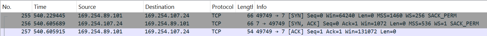
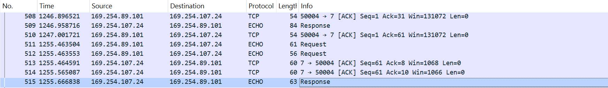

.. include:: ../../../../macros.txt
.. include:: ../../../../units.txt

.. _HOW_TO_TEST_TCP_IP:

How to Test TCP/IP
===================

.. warning::

   In Hardware version 1.2.3 and below, the PHY is enabled by default,
   which can cause issues when connecting the Ethernet cable.
   To avoid this, the pull-up resistors enabling the PHY should be removed.
   For more details, refer to :ref:`REMOVING_THE_PULL_UP_RESISTOR_FOR_THE_PHY`.

Most of the configuration is already done in the |foxbms| implementation.
If changes in the |freertos| port for |tcp-ip| are necessary, refer to
:ref:`HOW_TO_IMPLEMENT_ETHERNET_PORT`.
To use |tcp-ip|, configure it as described in :ref:`CONFIGURE_OS`.

To connect the |bms-master| with the Ethernet cable, refer to
:ref:`TI_TMS570_BASED_BMS_MASTER_V1_2_2_PINOUT`.
After the physical connection is established, the CAN message ``f_BmsState``
sets ``PhyLinked`` to ``1``.
Now |foxbms| can be pinged or the echo server can be used.

.. hint::

   It can be usefull to deactivate during testing other network connections as
   WiFi.

Debug the Network connection
-----------------------------

For debugging purposed the UART interface can be used.
The general configuration is described in :ref:`CONFIGURE_DEBUG`.

How to Ping |foxbms|
---------------------

This section shows how to send a simple ping message to |foxbms|.
In ``FreeRTOSIPConfig.h`` ``ipconfigREPLY_TO_INCOMING_PINGS`` is enabled.
This is why the |tcp-ip-stack| answers ping messages by default without a
server being initialized.
To enable |foxbms| to respond to ping, some application code is
provided in ``src/app/application/ethernet/ethernet.c``.

The interface descriptor is initialized with
``pxTMS570_FillInterfaceDescriptor``.
The IP address and other network parameters have to be set with
``FreeRTOS_FillEndPoint``.
To initialize the |tcp-ip-stack|, ``FreeRTOS_IPInit_Multi`` is called.
The tasks that use the network are created in the
``vApplicationIPNetworkEventHook`` hook function.
This hook function is called when the network connects.

Using Ping
^^^^^^^^^^^^

Ping is a standard program for checking an ethernet connection.
The default IP Address is **169.254.107.24**.
DHCP is currently not used, so static addresses need to be assigned.
All of the related configuration can be found in
``src/app/application/config/ethernet_cfg.c``.

When calling ``ping <ip address>`` it should return

.. code-block:: powershell

   PS > ping 169.254.107.24
   Pinging 169.254.107.24 with 32 bytes of data:
   Reply from 169.254.107.24: bytes=32 time<1ms TTL=255
   Reply from 169.254.107.24: bytes=32 time=1ms TTL=255
   Reply from 169.254.107.24: bytes=32 time=1ms TTL=255
   Reply from 169.254.107.24: bytes=32 time<1ms TTL=225

   Ping statistics for 169.254.107.24:
   Packets: Sent = 4, Received = 4, Lost = 0 (0% loss),
   Approximate round trip times in milli-seconds:
   Minimum = 0ms, Maximum = 1ms, Average = 0ms

With the parameter ``-n`` it is possible to choose the number of requests.

How to Test the Echo Sever
---------------------------

For testing the echo server the program Putty is used.
The default IP Address is **169.254.107.24** and the echo server port is **7**.
It has to be configured as follows:

Putty configuration:
``Session:Host Name:<foxBMS IP Address>``
``Session:Port:<foxBMS Echo Server Port>``
``Session:Connection Type:raw``

For better readability:
``Terminal:Implicit CR in every LF``
``Terminal:Implicit LF in every CR``

When establishing the connection it should output

.. code-block:: powershell

   Connected to client
   Started connection instance

With the tool Wireshark the TCP handshake can be observed.
It should look like in the image below.

   TCP-handshake

Now every input to the Putty terminal is echoed back.
The image below illustrates the data send.

   Log showing the TCP echo request and response

On closing the TCP connection another handshake is performed as shown in
:numref:`tcp-close`.

   Log showing the closing procedure of a TCP connection

See Also
--------

- :ref:`PHY_MODULE`
- :ref:`NETWORK_INTERFACE`
- :ref:`EMAC`
- :ref:`HOW_TO_IMPLEMENT_ETHERNET_PORT`
- :ref:`ETHERNET_MODULE`
