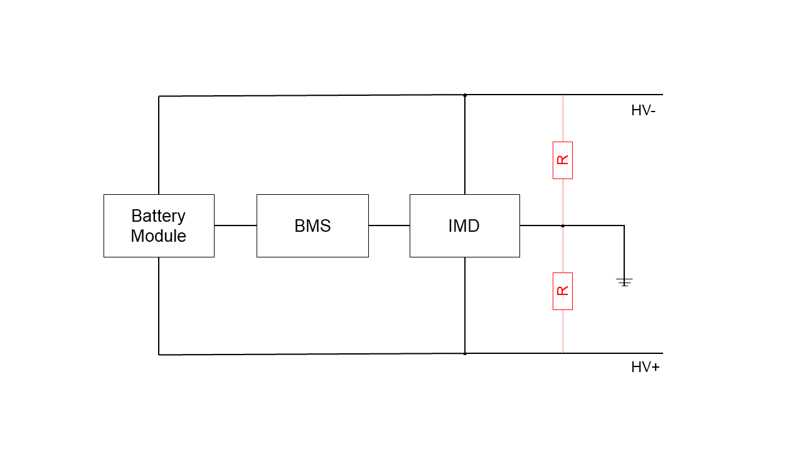

.. include:: ./../macros.txt
.. include:: ./../units.txt

.. _IMD_Testing:

###########
IMD Testing
###########

The :ref:`INSULATION_MEASUREMENT_DEVICE` measures the insulation
resistance between the high voltage potentials.
Low insulation resistance induces a high safety risk, to sense this danger the
IMD is used.
To ensure the correct functionality testing the IMD on the actually implemented
system is very important.

    Resistance measured by the IMD (in red)

****************
Test preparation
****************

Needed to test the IMD are:

- |foxbms| workspace as described in :ref:`GETTING_STARTED_WITH_FOXBMS_2`
- resistors with different values are required

.. table:: important resistance values
   :name: important-resistance-values
   :widths: grid

   +-------------------+-------------------+--------------------+
   | R\ :sub:`max` *   | R\ :sub:`warning` | V\ :sub:`critical` |
   +===================+===================+====================+
   | 50\ |MOhm|        | 750\ |kOhm|       | 500\ |kOhm|        |
   +-------------------+-------------------+--------------------+

\* maximum resistance measurable by the supported IMD devices (see
:ref:`INSULATION_MEASUREMENT_DEVICE`).

******************
Testing resistance
******************

First ``data_blockInsulationMonitoring`` and ``data_blockErrors`` is added to
the watch window of the debugger to observe the output of the IMD.

To test if resistance is read correctly put a resistor between the high voltage
connectors and the ground/chassis potential.

After a slight delay it reports the resistance of the resistor which can be
read in the insulation monitoring data table.

If the resistance is lower than the warning threshold of 750\ |kOhm| the
``warnableLowInsulationResistanceError`` will be set.
If the resistance is lower than the critical threshold of 500\ |kOhm| the
``criticalLowInsulationResistanceError`` will be set.
