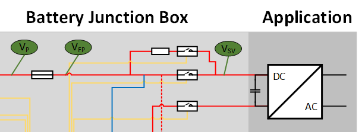

.. include:: ./../macros.txt
.. include:: ./../units.txt

.. _PRECHARGING:

###########
Precharging
###########

Precharging of the powerline voltages is a requirement in high voltage DC
applications to limit the potentially high inrush current during the startup.

Most applications like e.g., motor inverter systems have a rather high
capacitance.
By connecting the application with the battery system a large inrush current
would occur as the load capacitance is charged up to the pack voltage.
This current can easily peak at 1000 A.
Therefore a precharging circuit is needed when initially connecting
a battery system to an application to limit the inrush current to a sensible
value.
Precharging prevents e.g., fuse triggering, excess heating, damage of the
components or weld shutting of the main contactor by limiting the inrush current.

As shown in :numref:`battery-system-precharging`, a precharge circuit consists
of:

* a precharge resistor to limit the inrush current
* a switch or contactor in series to the precharge resistor to
  activate/deactivate precharging

    Precharging circuit in a battery system

***************
Operation modes
***************

Basically, a battery system has three operating modes.

* *Off*: All contactors connecting the battery system with the application are
  open.
* *On*: All contactors connecting the battery system with the application are
  closed, i.e., power can be drawn from the system.
* *Precharge*: The application is electrically connected to the battery system.
  The precharging contactor is closed to start the precharging process until
  the inrush current meets a defined threshold in the maximum specified time.
  If the application could be not precharged within the expected maximum time,
  precharging is aborted and the BMS goes back into *off* mode.
  The precharge resistor in combination with the application capacitance forms
  the RC time constant :math:`\tau`.

********************
Combination with BMS
********************

Another functionality that can be derived by analyzing the precharging process
is to detect failures in the application.
In normal operation the inrush current decreases as the voltage difference
between the battery and the application gets smaller.
If there is a short in the application the current flow will stay close to the
inrush current.
By measuring the voltage and current the BMS can detect the problem if the
normal operation conditions are exceeded by a certain time and report a timeout
failure.

**********************
Precharge Dimensioning
**********************

The project contains a tool to help with the dimensioning of the precharging
resistor at ``tools/precharge/precharge_dimensioning.ipynb``.

***************
Further Reading
***************

For further information on precharging see e.g., :cite:`Andrea2014`.
