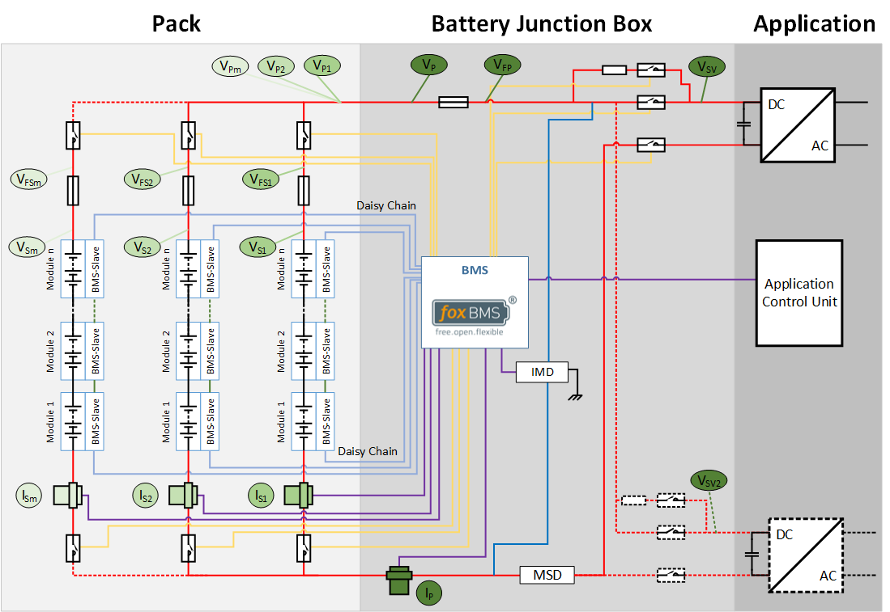
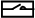
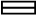
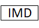
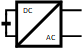
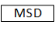
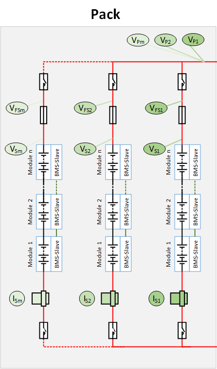
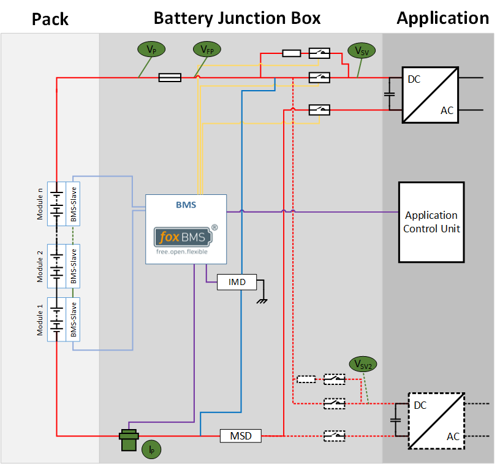
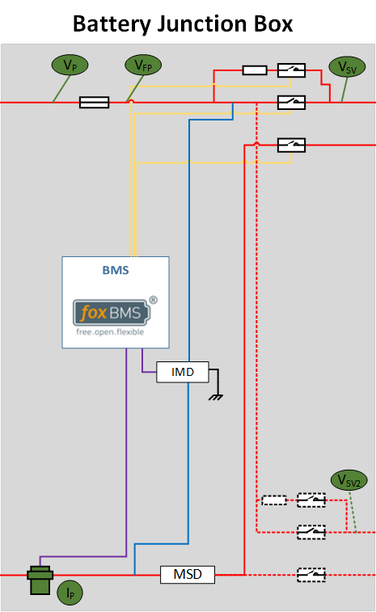

.. include:: ./../macros.txt
.. include:: ./../units.txt

.. _SYSTEM_VOLTAGE_AND_CURRENT_MONITORING:

#####################################
System Voltage And Current Monitoring
#####################################

Several different voltages inside a battery system need to be measured.
The exact number of voltages is dependent on the system topology and the
configuration of the battery system.

:numref:`start-high-level` shows the voltages that need to measured in a
multi-string system, here for example for a 3-string system.
The symbols are explained in :numref:`symbols-in-system-block-diagram`.
The colors are explained in :numref:`colors-in-system-block-diagram`.

The left side of the image shows the *Battery Pack*.
The *Battery Junction Box* is depicted in the center of the figure with an
indicated connected application shown on the right side the of the picture.

    Voltages of interest in a multi-string system (click to enlarge)

.. table:: Symbol description
    :name: symbols-in-system-block-diagram
    :widths: grid

    +-------------------+-------------------------------+
    | Symbol            | Meaning                       |
    +===================+===============================+
    | |contactor|       | Contactor                     |
    +-------------------+-------------------------------+
    | |current-sensor|  | Current sensor                |
    +-------------------+-------------------------------+
    | |fuse|            | Fuse                          |
    +-------------------+-------------------------------+
    | |imd|             | Insulation Measurement Device |
    +-------------------+-------------------------------+
    | |inverter|        | Inverter                      |
    +-------------------+-------------------------------+
    | |msd|             | Manual Service Disconnect     |
    +-------------------+-------------------------------+
    | |resistor|        | Resistor                      |
    +-------------------+-------------------------------+

.. table:: Color description
    :name: colors-in-system-block-diagram
    :widths: grid

    +-------------------+-----------------------------------+
    | Symbol            | Meaning                           |
    +===================+===================================+
    | |red|             | Power path                        |
    +-------------------+-----------------------------------+
    | |dotted-red|      | Second power path (optional)      |
    +-------------------+-----------------------------------+
    | |purple|          | CAN                               |
    +-------------------+-----------------------------------+
    | |dark-yellow|     | Contactor control and feedback    |
    +-------------------+-----------------------------------+
    | |dark-blue|       | Insulation measurement line       |
    +-------------------+-----------------------------------+
    | |blue|            | Daisy-chain                       |
    +-------------------+-----------------------------------+

*******************
Multi-String System
*******************

The following section describes important parameters within a multi-string
battery pack.

Measurements Inside the Battery Pack
====================================

    Voltages to be measured in a multi-string system inside the battery pack
    (click to enlarge)

The strings are depicted in ascending order from right to left starting with
string 1 (``S1``) until left-most string m (``Sm``).
Each string consists of ``n`` modules, where every module has its own |slave|.
Each string features a current sensor, a string fuse and one or two string
contactors.
Thus, the following voltages need to be measured in each string:

- *String voltage*, short V\ :sub:`Sm`, where ``m`` indicates the number of
  the string.
- *Fused string voltage*, short V\ :sub:`FSm`, where ``m`` indicates the number
  of the string.
  It is measured between the lowest module and after the string fuse.
- *Pack voltage*, short V\ :sub:`Pm`, where ``m`` indicates the number
  of the string.
  It is measured between the negative pole of the lowest module and behind the
  positive string contactor.
  This voltage is identical for all connected strings and enables measurement
  validation.

The current sensor additional measures each string current.

Comprehension of measured voltages and current in the pack:

+---------------+---------------------------------------+
| Symbol        | Description                           |
+===============+=======================================+
| V\ :sub:`Sm`  | Voltage of string m                   |
+---------------+---------------------------------------+
| V\ :sub:`FSm` | Voltage after string fuse of string m |
+---------------+---------------------------------------+
| V\ :sub:`Pm`  | Pack voltage                          |
+---------------+---------------------------------------+
| I\ :sub:`Sm`  | Current in string m                   |
+---------------+---------------------------------------+

********************
Single-String System
********************

A single-string system reduces the amount of required voltage and current
measurements.
:numref:`measurements-in-single-string-system` shows the single-string
topology.

    Voltages and current to be measured in a single-string system (click to
    enlarge)

The list of measurements is therefore reduced to
:numref:`pack-measurements-single-string-system` and no further measurements
inside the string are required.

.. csv-table:: List of measurements in single-string system
   :name: pack-measurements-single-string-system
   :header-rows: 1
   :delim: ;
   :file: ./bjb-measurements.csv

********************************************
Measurements Inside the Battery Junction Box
********************************************

    Voltages to be measured in a multi-string system in the BJB (click to
    enlarge)

- The pack voltage is measured before the main fuse.
- The fused pack voltage is measured after the main fuse.
- The system voltage is measured after the contactors.
- **optional**: If the system uses a second power path, the second power path
  voltage is measured after the contactors of the second power path.

Comprehension of measured voltages and current in the battery junction box:

.. csv-table:: List of measurements in multi-string system
   :name: pack-measurements-multi-string-system
   :header-rows: 1
   :delim: ;
   :file: ./bjb-measurements.csv
