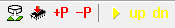

.. include:: ./../../macros.txt
.. include:: ./../../units.txt

.. _LAUTERBACH_TRACE32_DEBUGGER:

Lauterbach Trace32 debugger
===========================

..
    Comments:
    Mictor is a connector

.. spelling::
    Mictor

Some information can be found in ``tools/debugger/lauterbach/commands.md``.
Please carefully read the
`basic manual <https://www2.lauterbach.com/pdf/training_debugger.pdf>`_
for Lauterbach.

After setting up the hardware connection you should be able to load
the Trace32 application. For details on where to find a ready configuration
for |foxbms|, please refer to :numref:`WAF_TOOL_LAUTERBACH`.

   Most relevant buttons in Trace32 from left to right: Select ELF file,
   Download ELF to target, Load symbols, Unload symbols, Up and Go the target,
   Up the target, Down the target

:numref:`lauterbach-buttons` shows the most relevant buttons in Trace32.
For a normal download onto the target with a subsequent debug session you have
to select the ELF file, then set the target to "Up"-state, download the ELF
file onto the target and then press the "Up and Go"-button in order to reset
the target and start with an attached debugger.

Using a trace probe
^^^^^^^^^^^^^^^^^^^
Lauterbach supplies in addition to the debug probes also a trace probe for the
TMS570LC4357 target. Please refer to their customer support for details.

The setup of `Fraunhofer IISB`_ consists of a LA-3505 debugger connected to a
LA-3580 trace probe with the LA-7992 parallel preprocessor for ARM/Cortex
architectures. |foxbms| features a compliant Mictor-38 connector in order
to be able to connect trace ports with up to 8 bit. If you need more bandwidth,
please contact us. The standard design can be adapted to up to 32 bit trace
bandwidth.
