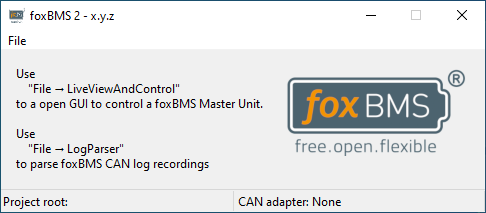
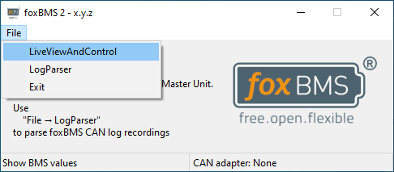

# foxBMS 2 GUI

## Starting the GUI

In order to start the gui, run ``gui.bat``.

## How to

1. After running the helper script, the tool selection opens
   

1. Next a tool can be select, to either
   - view battery system parameters during operation and control the BMS (``LiveViewAndControl``) or
   - parse and visualize CAN logs generated by |foxbms| (``LogParser``).

   

### LiveViewAndControl

### LogParser
